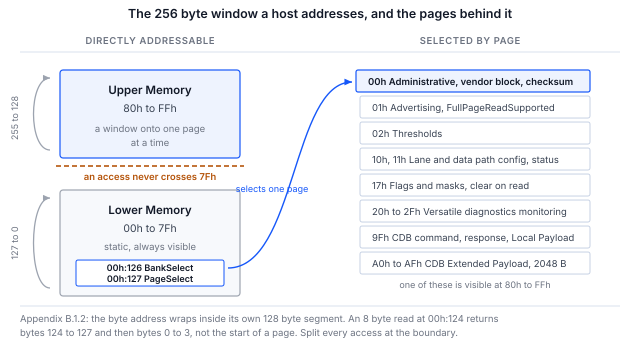

> **Draft, revision 0.3.** Every command in Section 5 has been run, and every output shown
> is pasted from that run. It was run against a **Binho Supernova in I2C target mode
> presenting a CMIS image**, not against an optical module, so the procedure and the host
> path are exercised while the module's own behavior is not. Section 8 states exactly what
> that covers and what it does not. This revision is for internal review and is not for
> publication.

## 1 Introduction

A CMIS exchange on a wire is a paged, stateful conversation. A single register read is a
write of a byte offset, a repeated START, and a read. What that offset means depends on a
bank and page selection that may have been written in an earlier transaction, may have
been silently overridden by the module, and rolls over inside its own 128 byte segment
rather than across the address space.

That is why "the module answered" is not the same as "the module is working", and why the
first hour of a bring-up is so often spent debugging a host against bytes that were never
what the engineer thought they were.

This note establishes, from a Binho USB host adapter and nothing else, that a module is
present, willing to be read, correctly paged, and internally self consistent. It ends on a
checksum the module itself computed, because that is the outcome an absent or unpowered
target is least able to produce by accident. Section 4 gives the one case where it can, and
the condition that rules the case out.

### 1.1 Scope

By the end of this document a reader with the hardware in front of them will have detected
a module on the management bus, polled it for readiness, decoded its identity and module
state, read its temperature and supply monitors, discovered its maximum access length from
its own advertisement, read its vendor block from Upper Memory, and validated the Page 00h
checksum.

The document covers the I2C management interface (I2CMCI), which CMIS Appendix B.2
specifies normatively and which every deployed module implements. The SPI interface is
covered in AN0010 and an I3C binding in AN0009. Firmware update, the Common Data Block and
performance monitoring are out of scope; the firmware update timing question is AN0011.

### 1.2 Applicable devices

Table: Applicable devices

| Item | Role | Basis |
|---|---|---|
| Binho Supernova | Host adapter, I2C controller | Exercised, Section 8 |
| Binho Pulsar | Host adapter, I2C controller | Not exercised. The SDK differs only in taking a bus selector |
| Any CMIS managed module | Target at address 0x50 | **Not exercised.** See the callout below |
| Saleae Logic with the CMIS I2CMCI analyzer | Optional bus observer | Analyzer is in development |

> **The procedure has not been run against an optical module.** It has been run end to end
> against a second Supernova armed as an I2C target at 0x50, holding a CMIS 5.3 image. That
> exercises the host, the register access layer, the paging and the checksum, all of which
> are the subject of this document. It does not exercise anything that belongs to a module:
> hold-off behavior, page support, or the roll-over rule. Findings are attributed to the
> layer they belong to throughout, and Section 8.3 lists what a module would still have to
> confirm. It becomes revision 1.0 when it has been run against one.

### 1.3 Related documents

Table: Related documents

| Document | Subject |
|---|---|
| OIF-CMIS-05.3 | Common Management Interface Specification, revision 5.3, 4 September 2024 |
| OIF-CMIS-05.4 | Revision 5.4, 21 May 2026, used to cross-check |
| SFF-8024 | Identifier code registry referenced by CMIS byte 00h:0 |
| AN0009 | Managing a CMIS optical module over I3C with the Binho Supernova |
| AN0010 | Bringing up a CMIS optical module over SPI with the Binho Pulsar |
| AN0011 | Measuring CMIS firmware update time with the Binho Supernova |

## 2 Required equipment and software

### 2.1 Hardware

Table: Required equipment

| Item |
|---|
| Binho Supernova or Binho Pulsar USB host adapter |
| A CMIS managed optical module, or a module evaluation board |
| USB-C cable |
| Saleae Logic capture hardware, optional |

### 2.2 Connections

Table: Connections between the adapter and the module

| Adapter | Module | Required |
|---|---|---|
| SCL | Management clock | Yes |
| SDA | Management data | Yes |
| 3V3 | Management supply | Yes, unless the board supplies its own |
| GND | Return | Yes |

> **Caution:** confirm the module's management rail before connecting the adapter's 3V3.
> The adapter can supply the rail or accept an external one, and the procedure below uses
> the adapter's. Where the carrier board already supplies it, use the adapter's external
> voltage mode instead of driving a second source onto the same net.

The adapter has software selectable pull-ups. Where the module board already carries them,
disable the adapter's rather than placing a second set in parallel.

### 2.3 Software

```
pip install binhosupernova        # Supernova
pip install binhopulsar           # Pulsar
```

The utility supplied with this note, `cmis_mci.py`, needs one of those packages and the
Python standard library. Nothing else.

Two of its commands need no adapter and no module at all, and are worth running first
because they establish that the address arithmetic in the tool is correct before any
hardware is involved:

```
python cmis_mci.py selfcheck
python cmis_mci.py budget
```

## 3 The CMIS management model

CMIS chapter 4.2 separates the register model from the transport that carries it, and the
separation is the reason this document's procedure survives a change of bus.

Table: The layers that matter to a host

| Layer | What it is |
|---|---|
| RAL, chapter 5 | Exactly three primitives, READ, WRITE and TEST, over a 256 byte window |
| MCI, Appendix B | The swappable transport binding that carries them: I2CMCI or SPIMCI |
| MSL, section 5.1 | Discrete pins with fixed management meaning, of which Reset and Interrupt are required |

The 256 byte window is divided into **Lower Memory**, byte addresses 00h through 7Fh,
which is static and always visible, and **Upper Memory**, 80h through FFh, which is a
window onto a much larger memory selected by `BankSelect` at 00h:126 and `PageSelect` at
00h:127.



Figure 1 is the whole model on one page. Two properties of it produce most first-day
confusion, and both are covered in Section 6: the address wraps inside its own 128 byte
segment rather than running on, and a page the host selected is not necessarily the page
the module is on.

### 3.1 Every module answers at 0x50

The I2CMCI control byte is A0h for a write and A1h for a read. Shifted right by one, that
is 7-bit address **0x50**, and CMIS provides no address strapping. Every CMIS module ever
built answers there.

On a point-to-point link with an optional ModSel pin that is unremarkable. It becomes a
design question the moment more than one module shares a bus, which is where AN0009 picks
the subject up.

### 3.2 Access length is advertised, not assumed

Table: Access length limits

| Direction | Limit | Source |
|---|---|---|
| READ | Nmax = 8 by default, 128 when full page read is advertised | Section 5.2.2.1 |
| WRITE | Up to eight byte values, always | Section 5.2.2.2 |
| WRITE, CDB Extended Payload | More than 8, where chapter 7.8 says so | Section 5.2.2.2 note |

The asymmetry is easy to miss and it matters: `FullPageReadSupported` raises the limit for
reads only. Section 5.2.2.2 says a successful WRITE "writes a sequence of up to eight given
byte values", with no advertisement that changes it. AN0011 is built on the consequence.

> **Specification defect.** Section 5.2.2.1 cites the full page read advertisement at
> `01h:251.4`. The field is `FullPageReadSupported` at **`01h:251.1-0`**, a two bit
> encoding where 00 is unknown, 01 is not supported and 10 is supported. The CMIS 5.4
> revision history confirms the two bit field. Any host that checks the advertisement
> trips over this immediately. The supplied utility reads the correct address and treats
> "unknown" as the conservative default of 8.

### 3.3 Module state

Table: Module State Machine states, Table 6-14

| Value | State |
|---|---|
| 1 | ModuleLowPwr |
| 2 | ModulePwrUp |
| 3 | ModuleReady |
| 4 | ModulePwrDn |
| 5 | ModuleFault |

The state is at `00h:3.3-1`. One deadline applies at power-on: `MgmtInit` must reach
`ModuleLowPwr`, meaning the interface is ready and an interrupt has been raised with
`ModuleStateChangedFlag` set, within **tMgmtInit = 2000 ms**. A module polled sooner than
that is not necessarily faulty.

Flat memory modules skip the handshake. Interface ready is assumed after tMgmtInit, so a
host simply waits the period out.

## 4 What each step proves

The procedure in Section 5 is short. Each step is there because skipping it produces a
confident wrong answer later, and this section is the reason each one earns its place.

Table: The bring-up sequence and what each step establishes

| Step | Register | What it rules out |
|---|---|---|
| Bus scan | none | The module is not on the bus at all, which no software explanation can fix |
| TEST | none | The module is present but still rejecting accesses, for example during MgmtInit |
| Identity | 00h:0 to 00h:2 | The wrong form factor, and a revision decoded as hexadecimal |
| Module state | 00h:3.3-1 | A module in fault or still powering up being read as if it were ready |
| Monitors | 00h:14 to 00h:17 | Plausible but constant bytes: a live temperature and rail cannot be coincidence |
| Advertisement | 01h:251.1-0 | An access longer than the module accepts, which fails intermittently |
| Vendor block | 00h:129 onward | Paging that never worked, since these bytes are in Upper Memory |
| Checksum | 00h:222 | Everything above, at once |

**Identity is decimal coded.** `00h:1` holds the CMIS revision as two decimal digits, so
`0x53` is CMIS 5.3, not 8.3.

**Monitors carry their scaling in the specification, not on the wire.** `TempMonValue` at
`00h:14` is a signed 16-bit value in 1/256 degree Celsius increments, and `VccMonVoltage`
at `00h:16` is unsigned 16-bit in 100 microvolt increments.

**The checksum is the strongest check available, and it needs one condition to mean
anything.** It covers Page 00h bytes 128 through 221, 94 bytes of module specific content,
against a byte the module itself wrote at `00h:222`. A stale buffer, a floating bus, or a
target that was never armed will normally fail it, and reaching those bytes also proves
that paging worked, since they are in Upper Memory.

> **Caution:** a bus that returns the same byte for every read agrees with itself. Ninety
> four bytes of `00h` sum to `00h`, and the stored checksum read from that same bus is also
> `00h`, so the comparison passes while proving nothing. All `00h` is the case that matters,
> because `00h` is what an idle bus returns and it is also SPIMCI's acknowledgement. Treat
> the checksum as valid only when Page 00h carries more than one distinct value. The utility
> supplied with this note enforces that; a host that compares the two bytes and nothing else
> will report a healthy module on an empty bus.

## 5 Procedure

### 5.1 Confirm the tool before confirming the module

```
python cmis_mci.py selfcheck
```

This runs the address arithmetic against a simulated module that obeys the B.1.2 wrap rule
and the 8.2.15 page override, with no adapter attached:

```
  [OK] an access splits at 7Fh and at Nmax
  [OK] identity and module state decode
  [OK] Page 00h checksum agrees, in accesses of Nmax or fewer bytes
  [OK] FullPageReadSupported raises Nmax, and the 94 byte read fits in one access
  [OK] an all-zero page is rejected, not read as a checksum that agrees
  [OK] a module that overrides an unsupported page is caught, not believed
  [OK] TEST answers on a live module
  [OK] a write stays within the 8 byte WRITE limit while reads use Nmax

cmis_mci.py 1.0 self-check: 8/8 OK
```

### 5.2 Find the module

```
$ python cmis_mci.py scan
0x50  <- CMIS module
```

The command reports every address that answers and marks 0x50. If nothing answers there,
the fault is power or the management pins, and no amount of software investigation will
move it.

### 5.3 Run the bring-up

```
$ python cmis_mci.py bringup
MCI     : I2CMCI
TEST()  : ready
00h:0   : 0x18 QSFP-DD
00h:1   : CMIS 5.3
00h:2   : MciMaxSpeed code 5
00h:3   : ModuleReady
00h:14  : 34.50 C   (S16, 1/256 C)
00h:16  : 3.300 V   (U16, 100 uV)
01h:251 : FullPageReadSupported gives Nmax 8 bytes for reads
00h:129 : VendorName 'BINHO PHOTONICS'
00h:148 : VendorPN   'QDD-400G-DR4'
00h:166 : VendorSN   'SN2608140001'
00h:222 : checksum computed 0x5b, module stores 0x5b, OK

PASS    : present, readable, paged correctly and self consistent.
```

The command performs, in order, the steps tabulated in Section 4, and exits non-zero if
the Page 00h checksum does not match.

Two lines in that output are worth reading carefully, because both are the procedure
working rather than failing.

`MciMaxSpeed code 5` is **reserved** in the I2CMCI encoding, which defines only 0, 1 and 2.
The target here reports it, so the value is shown rather than silently mapped to something
plausible. A host that prints "3.4 MHz" for an undefined code is guessing.

`FullPageReadSupported gives Nmax 8` is the conservative branch. The advertisement at
`01h:251.1-0` read back as 00, meaning unknown, and unknown is not "supported". A host that
treats it as 128 issues accesses the target never agreed to.

### 5.4 Read and write individual registers

```
$ python cmis_mci.py read  --byte 3
00h:3 x1 = 07

$ python cmis_mci.py read  --page 01h --byte 251
01h:251 x1 = 00

$ python cmis_mci.py write --byte 127 --data 01
wrote 01, read back 01, match
```

Every write is followed by a read-back and the result is reported, because a write that
was never read back is not evidence that anything landed.

`00h:3 = 07` decodes as ModuleReady: bits 3-1 of `07h` are `011`, which is state 3.

### 5.5 Read the vendor block

```
$ python cmis_mci.py identify
identifier    0x18 QSFP-DD
CMIS revision 5.3
VendorName    'BINHO PHOTONICS'
VendorOUI     00 00 00
VendorPN      'QDD-400G-DR4'
VendorRev     '1A'
VendorSN      'SN2608140001'
DateCode      '260814AB'
```

Every field above lives in Upper Memory on Page 00h, so reading them at all is evidence
that the page selection worked.

## 6 Two ways to read the wrong bytes

Both of these produce output that looks entirely reasonable, which is what makes them
expensive.

### 6.1 The address wraps inside its segment, it does not run on

Appendix B.1.2 is unambiguous: the current byte address rolls over within its own 128 byte
segment, 127 back to 0 and 255 back to 128, and never crosses between Lower and Upper
Memory. An eight byte read at `00h:124` therefore returns bytes 124 to 127 and then bytes
0 to 3, not the start of Page 00h.

The supplied utility splits every access at the segment boundary, so the case cannot arise
through it:

```
split_access(124, 8, nmax=8)   ->   [(124, 4), (128, 4)]
```

NXP AN15071 section 2.1.1 specifies the opposite rule for its I3C target, wrapping at FFh
across the whole 256 byte space. The `rollover` command establishes which rule a given
target implements:

```
$ python cmis_mci.py rollover
8 bytes from 00h:124, last four : 18 42 49 4e
00h:0-3                         : 18 53 54 07
Page 00h:128-131                : 18 42 49 4e

ran on into Upper Memory, as NXP AN15071 2.1.1 specifies
Either way, do not issue an access that crosses 7Fh. Split it.
```

> **That result is a property of the fixture, not of CMIS and not of any module.** The
> target used here is a Binho Supernova in I2C target mode, which presents a flat memory
> arena and therefore runs on across 7Fh. It is reproduced because it is what the command
> reported, and because it demonstrates the case the command exists to detect. Do not read
> it as evidence about optical module behavior.

### 6.2 A page you wrote is not a page you are on

Section 8.2.15 lets the module override a host page write. Selecting an unsupported page
leaves `PageSelect` holding a supported one instead, and reports no error anywhere. A
passive observer cannot know which pages a module supports.

The utility therefore reads the selection back and raises rather than returning data from a
page the host is not on:

```
CmisError: module overrode the page selection: asked for bank 0x00 page 0x99,
           it is on bank 0x00 page 0x00 (CMIS 8.2.15, page not supported)
```

## 7 The utility

Table: Utility commands

| Command | Purpose |
|---|---|
| `selfcheck` | Check the address arithmetic offline, against a simulated module |
| `scan` | Report what answers on the bus |
| `bringup` | The module discovery sequence, end to end |
| `identify` | Decode the identity and vendor block |
| `read`, `write` | Register access, with a read-back after every write |
| `rollover` | Establish which address wrap rule the module implements |
| `spi-probe` | Establish the SPIMCI flow control count and R/Wn polarity |
| `timing` | Time the access phases against the Table 10-4 ceilings |
| `budget` | Firmware update time budget, offline |
| `ibi` | Count in-band interrupts, I3C only |

`--transport i2c`, `i3c` or `spi` selects the management interface. The register model is
one implementation; only the transport under it changes.

## 8 Measured results

### 8.1 Test configuration

Table: Test configuration

| Item | Value |
|---|---|
| Controller | Binho Supernova, serial `1912DEB5…79FA`, firmware 4.4.0, hardware revision C |
| Target | Binho Supernova, serial `ED7BF8F3…F7BB`, firmware 4.4.0, hardware revision C, armed as an I2C target at 0x50 |
| Target contents | CMIS 5.3 image, the Appendix C 400G QSFP-DD worked example, 256 bytes covering Lower Memory and Page 00h |
| SDK | `binhosupernova` 4.2.0, Python 3.10.12 |
| Host | Ubuntu 22.04, x86-64 |
| Bus | 3.3 V, 400 kHz, adapter pull-ups, direct cable between the two adapters |

> **The target is an adapter, not an optical module.** The second Supernova is armed as an
> I2C target holding a CMIS image, which makes it a faithful fixture for the register model
> and an unfaithful one for everything that belongs to a module. Section 8.3 draws the line.

### 8.2 Results

**Offline.** The address arithmetic self-check passes 8 of 8 against the simulated module,
covering segment boundary splitting, the Nmax read limit, the 8 byte write limit, the Page
00h checksum, the `FullPageReadSupported` decode, and the section 8.2.15 page override.

**Bus scan.** The target answers at 0x50 and at no other address.

**Bring-up.** All eight steps of Section 4 complete, and the Page 00h checksum computes to
`0x5B` against a stored `0x5B`. Reaching the checksum bytes required a page selection, a
94 byte read split into Nmax sized accesses, and a separate read of `00h:222`, so the
agreement covers the paging and the access splitting as well as the data.

**Advertisement.** `01h:251.1-0` reads 00, unknown, and the host held `Nmax` at 8. The
target holds no Page 01h content, so this is the correct conservative outcome rather than
a suppressed feature.

**Register access.** `00h:3` reads `07`, decoding as ModuleReady. A write of `01` to
`00h:127` and a write of `00` after it both read back byte for byte.

**Two defects were found by running this, and both are fixed in the supplied utility.**
Neither was visible from reading the code. The bus scan parsed the wrong key out of the SDK
response, so a target that was on the bus was reported as absent; `binhosupernova` 4.2.0
answers with `detected_7_bit_addresses`, and an unrecognised response shape now raises
instead of returning an empty list. Separately, `argparse` shares action objects between
subparsers created with `parents=`, so a default set on one subcommand became the default
for all of them and every command ran as though `--transport i3c` had been given.

### 8.3 What a real module would still have to confirm

Everything in this section belongs to the host and the register model. None of it is
evidence about a module. Outstanding:

Table: Outstanding against a real module

| Question | Why the fixture cannot answer it |
|---|---|
| Hold-off behavior, tREAD and tWRITE | The fixture answers immediately. It has no reason to stretch a clock or NACK |
| Which pages the module supports | The fixture accepts every page. The section 8.2.15 override is exercised only in the offline self-check |
| The roll-over rule, Section 6.1 | The fixture implements a flat arena, so it runs on across 7Fh rather than wrapping. See the note in Section 6.1 |
| `FullPageReadSupported` when it reads 10 | No target here advertises full page read, so the 128 byte path is exercised offline only |
| Monitor values that track a physical quantity | The temperature and voltage read back are the image's stored bytes, not a measurement |

## 9 Troubleshooting

Table: Troubleshooting

| Symptom | Probable cause and action |
|---|---|
| Nothing answers at 0x50 | Management rail absent, or SCL and SDA not connected. Check power first, not software |
| The bus scan finds the module but TEST is refused | The module may still be in MgmtInit. Wait tMgmtInit, 2000 ms, and retry |
| Identity reads as a valid form factor but the checksum fails | Paging is not doing what the host thinks. Read `00h:127` back after selecting |
| A multi-byte read returns bytes from a different page | The access crossed 7Fh. Split it at the segment boundary |
| A page selection appears accepted but reads return Page 00h | The module does not support that page and corrected it, per section 8.2.15 |
| Reads longer than 8 bytes fail intermittently | The module does not advertise full page read. Keep Nmax at 8 |
| The controller cannot drive a START | The bus has no pull-ups, or they are too weak. Enable the adapter's, or fit 2.2k to 4.7k |

## 10 Acronyms

Table: Acronyms

| Term | Meaning |
|---|---|
| CDB | Common Data Block |
| CMIS | Common Management Interface Specification |
| I2CMCI | I2C Management Communication Interface |
| MCI | Management Communication Interface |
| MSL | Management Signalling Layer |
| Nmax | Maximum number of bytes in one register access |
| OIF | Optical Internetworking Forum |
| RAL | Register Access Layer |
| SPIMCI | SPI Management Communication Interface |

## 11 Note about the source code in the document

Example code shown in this document and supplied in the accompanying archive is provided
for evaluation and reference. It is released under the MIT license, the text of which is
included in the archive.

Table: Contents of the assets archive

| File | Description |
|---|---|
| `AN0008.md` | Markdown source of this document |
| `assets/cmis_mci.py` | Reference utility, shared by AN0008 through AN0011 |
| `assets/LICENSE` | MIT license covering the example code |

## 12 Revision history

Table: Revision history

| Revision | Date | Description |
|---|---|---|
| 0.1 | 1 September 2026 | Draft for internal review. Specification content verified; procedure not yet run on hardware. |
| 0.2 | 1 September 2026 | Procedure run end to end against a Supernova I2C target fixture; all output in Section 5 is pasted from that run. Two utility defects found and fixed. Not yet run against an optical module. |
| 0.3 | 2 September 2026 | Renumbered from AN0007. Corrected the Page 00h checksum claim: a bench run showed an all-zero page passing the comparison, so the note no longer calls it a check that cannot pass by accident, and the utility rejects a page of one repeated value. |
