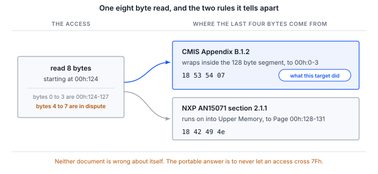
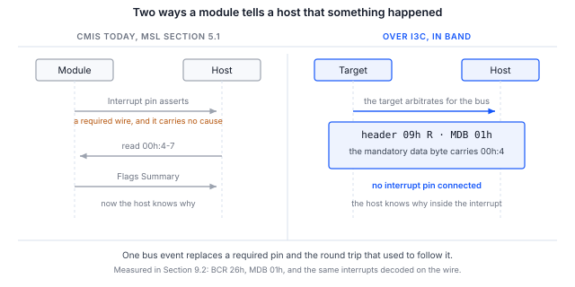

> **Draft, revision 0.5.** The specification content in this document is sourced and
> verified, and the procedure in Section 6 has now been run end to end against an I3C CMIS
> target, in-band interrupt delivery included. Section 9 carries the output, measured at the
> host and confirmed independently on the wire. This revision is for internal review and is
> not for publication.

> **No published revision of CMIS defines an I3C management communication interface.**
> CMIS 5.2 and 5.3 do not mention I3C at all. CMIS 5.4 section 1.3.2 lists an
> "I2C-compatible MCI based on I3C" among features expected in a forthcoming revision, so
> OIF has publicly committed to adding one and has not yet specified it. Table B-1 in both
> 5.3 and 5.4 lists exactly two MCI variants, I2CMCI and SPIMCI. Everything in this
> document that maps CMIS onto I3C is therefore a **Binho derivation, not an OIF CMIS
> binding**, and two vendors' derivations need not interoperate.

## 1 Introduction

The connector already allows it. OSFP-XD Revision 1.1 section 10.5.1 lists optional I3C
single data rate at 12.5 Mbit/s on the same SCL and SDA pins that carry the required
400 kbit/s I2C. An I3C managed module is legal at the connector today.

Silicon vendors are already building to it. NXP application note AN15071 ships a working
CMIS 5.3 target over I3C on the MCX N947 at 12.5 Mbit/s. To exercise it, NXP wrote
USB-to-I3C bridge firmware for a second development board and a bespoke host executable,
which is the gap this note fills with a shipping adapter.

What does not exist is a specification saying what correct looks like. This note is
therefore as much about the decisions an I3C binding forces as about the procedure, because
a reader adopting one has to make those decisions and write them down.

### 1.1 Scope

By the end of this document a reader with the hardware in front of them will have brought
an I3C CMIS target onto a bus by dynamic address assignment, read its identity and
validated its Page 00h checksum over I3C single data rate private transfers, established
which address roll-over rule it implements, and received an in-band interrupt from it with
no interrupt pin connected.

The document covers a level A binding, meaning I2CMCI semantics preserved byte for byte
over I3C private transfers, which is what NXP shipped and what will exist in laboratories
for the next two years. A native I3CMCI adopting SPIMCI's three dimensional addressing and
large transfers is discussed in Section 4 but is not implemented here, because it requires
OIF work that has not happened.

AN0008 covers the register model itself and is a prerequisite. This document assumes it.

### 1.2 Applicable devices

Table: Applicable devices

| Item | Role | Basis |
|---|---|---|
| Binho Supernova | Host adapter, I3C controller | Section 9, every command in Section 6 |
| NXP FRDM-MCXN947 running the Binho CMIS target firmware | I3C CMIS target | Section 9, enumeration through checksum |
| NXP MCX N947 running AN15071 firmware | I3C CMIS target | Not exercised for this note |
| Any I3C CMIS target at static address 0x50 | Target | Not exercised for this note |

> **The Binho Pulsar has no I3C interface.** This note requires a Supernova. The utility
> refuses `--transport i3c` on a Pulsar rather than failing later in a way that looks like
> a wiring fault.

> **The rows marked as not exercised are not claims.** The mapping in Section 4 is derived
> from OIF-CMIS-05.3 and 05.4, from MIPI I3C Basic v1.1.1, and from OSFP-XD Revision 1.1.
> Section 9 reports what we ran and against what. We have not run this note against a
> commercial optical module, and no result here should be read as one.

### 1.3 Related documents

Table: Related documents

| Document | Subject |
|---|---|
| OIF-CMIS-05.3, OIF-CMIS-05.4 | Common Management Interface Specification, and section 1.3.2 of 5.4 |
| OSFP-XD Specification Revision 1.1 | Section 10.5.1, two-wire speeds; section 10.5.2, INT and RSTn signalling |
| NXP AN15071 | Implementation of Optical module CMIS protocol over I3C on the MCX N947 |
| MIPI I3C Basic v1.1.1 | ENTDAA, SETDASA, SETAASA, ENEC and DISEC, in-band interrupts, hot-join |
| AN0008 | Bringing up a CMIS optical module over I2C with the Binho Supernova |

## 2 Required equipment and software

### 2.1 Hardware

Table: Required equipment

| Item |
|---|
| Binho Supernova USB host adapter |
| An I3C CMIS target. Section 9 used an NXP FRDM-MCXN947 running Binho CMIS target firmware |
| USB-C cable |
| Saleae Logic capture hardware, optional |

### 2.2 Connections

Table: Connections between the Supernova and the target

| Supernova | Target | Required |
|---|---|---|
| SCL | I3C clock | Yes |
| SDA | I3C data, bidirectional | Yes |
| 3V3 | Target supply | Yes, unless the board supplies its own |
| GND | Return | Yes |
| Interrupt pin | Module interrupt | No, and Section 7 is about why |

### 2.3 Software

```
pip install binhosupernova
python cmis_mci.py selfcheck
```

The utility supplied with this note is the same file supplied with AN0008, AN0010 and
AN0011. `--transport i3c` selects the I3C binding.

The Supernova drives `PUSH_PULL_12_5_MHZ_50_DC` by default, which is exactly the rate
OSFP-XD names, so the bring-up runs at the rate an OSFP-XD host would use rather than at a
convenient approximation of it.

`--push-pull` overrides that rate. A module that answers reads out of logic sustains
12.5 Mbit/s; a development target that answers them from firmware, in an interrupt, may
not, and the symptom is a short read or a NACK rather than an error that names the cause.
Section 9 records the rate its target needed and why.

## 3 Two levels of binding, and which one you are building

**Level A, I3C as a faster I2C.** Preserve I2CMCI semantics byte for byte over I3C single
data rate private transfers: the current byte address pointer, page selection through
00h:126 and 00h:127, and the 8 byte access limits. No specification change is required.
NXP's target sits at static address 0x50, which is A0h shifted right by one, preserving
continuity deliberately. This is what this note implements.

**Level B, a native I3CMCI.** Adopt SPIMCI's three dimensional addressing and large
transfers, ENTDAA for identity, in-band interrupts for the interrupt pin, hot-join for
insertion, and drop ModSel. This requires OIF work, which is precisely the opening for
anyone holding a working exerciser.

## 4 The mapping, mechanism by mechanism

Table: CMIS mechanisms carried onto I3C

| CMIS mechanism | How I2CMCI does it | On I3C | Verdict |
|---|---|---|---|
| Read and write framing | Control byte A0h or A1h after START | The control byte is the I2C address byte, so it collapses into the I3C address header and its RnW bit | Clean, one to one |
| Hold off the next access | NACK after the control byte, B.2.6.2 | NACK the address header | Clean, one to one |
| TEST readiness poll | Dummy write, watch for the ACK, B.2.5.5 | Zero length private write, or the address header ACK alone | Clean, one to one |
| Delay the current access | Clock stretching, abstracted by the RAL as tREAD, 500 microseconds maximum | Not available: I3C single data rate forbids target clock stretching | Costs nothing, must be written down |
| Interrupt | A required discrete pin, ton_Int up to 200 ms | In-band interrupt, whose mandatory data byte can carry the cause | Strict upgrade |
| Module insertion | Presence pin, then poll for up to tMgmtInit, 2000 ms | Hot-join, announced in band as soon as the module can talk | Strict upgrade |
| Bus sharing | None. Point to point, with an optional ModSel pin | Dynamic addressing removes ModSel entirely | Needs a decision, Section 5 |
| Maximum transfer length | Nmax, 8 by default | SETMWL, SETMRL and GETMXDS negotiate it natively | Redundant, needs a precedence rule |
| Speed discovery | MciMaxSpeed at 00h:2.5-2 | Neither the I2CMCI nor the SPIMCI encoding has a code point for I3C | Blocking specification hole |
| Broadcast | BankBroadcastEnable, within one module | Broadcast CCCs reach every module on the bus at one instant | A capability CMIS never had |

Three rows deserve more than a table entry.

### 4.1 tREAD is respecified, not lost

CMIS says outright that tREAD "is an abstraction of the I2CMCI clock stretch time". Because
it is defined as an abstraction over the mechanism rather than as the mechanism, an I3C
binding respecifies the abstraction rather than losing a capability. CMIS already models a
rejected access as a first class outcome, `REJECTED` in section 5.2.2.1, that the host
retries or pre-tests with `TEST()`.

> **Naming, because it is easy to get wrong.** At the RAL level the 10 ms volatile hold-off
> is **tWRITE**. *tNACK* is the I2CMCI level parameter that tWRITE abstracts, and tWRITENV
> likewise abstracts I2CMCI's *tWR*. The distinction matters here precisely because an I3C
> binding replaces the I2CMCI layer: the RAL level symbol survives, the I2CMCI level one
> does not.

### 4.2 The speed advertisement has no code point for I3C

OSFP-XD tells the host to read `MciMaxSpeed` at `00h:2.5-2` to discover that the module
supports I3C single data rate at 12.5 Mbit/s. The register cannot express it.

Table: MciMaxSpeed encodings

| Transport | Encoding |
|---|---|
| I2CMCI | 0 = 400 kHz, 1 = 1 MHz, 2 = 3.4 MHz, 3 to 15 reserved |
| SPIMCI | 0 = 1, 1 = 2, 2 = 4, 3 = 8, 4 = 12, 5 = 16, 6 = 20 MHz |
| I3C | No encoding exists in any published revision |

That SPIMCI received its own encoding table when it was added is the precedent for how an
I3CMCI would have to be introduced, and it is a cheap and specific contribution for anyone
in a position to make one.

### 4.3 Roll-over: two documents, two incompatible rules

CMIS Appendix B.1.2 wraps the current byte address within its own 128 byte segment. NXP
AN15071 section 2.1.1 wraps at FFh across the whole 256 byte space. These are different
behaviors on the same access and neither document is wrong about itself.



Figure 1 is the whole disagreement on one page. An eight byte read at `00h:124` tells the
two rules apart, because bytes 4 through 7 come back either as `00h:0-3` or as the start of
Page 00h:

```
python cmis_mci.py rollover --transport i3c
```

Run against the target in Section 9, the answer is the CMIS rule:

```
8 bytes from 00h:124, last four : 18 53 54 07
00h:0-3                         : 18 53 54 07
Page 00h:128-131                : 18 42 49 4e

segment wrap, as CMIS B.1.2 specifies
```

The last four bytes are Lower Memory at 00h:0-3 and not the start of Page 00h, so this
target wraps inside the segment.

The command discriminates in both directions. Run against a Binho adapter placed in I2C
target mode, whose memory is one flat arena, the same eight byte read returns the other
answer:

```
8 bytes from 00h:124, last four : 18 42 49 4e
00h:0-3                         : 18 53 54 07
Page 00h:128-131                : 18 42 49 4e

ran on into Upper Memory, as NXP AN15071 2.1.1 specifies
```

That second result is a property of that adapter's memory model. It is not a statement
about any optical module, and neither result is evidence about any target other than the
one it was run against. That is the reason the command exists rather than a table of
vendors.

Whichever rule a target implements, the portable answer for a host is the same: never issue
an access that crosses 7Fh, and split it instead.

## 5 Every CMIS module answers at 0x50

There is no address strapping in CMIS. A0h shifted right by one is 0x50 for every module
ever built. On a point to point I2C link with a ModSel pin that is unremarkable.

On a multi-drop I3C bus it is a decision that cannot be avoided:

- **SETDASA and SETAASA both key off the static address**, so they can bring up exactly one
  module. A second module at the same static address cannot be addressed by either.
- **Multi-drop requires ENTDAA** and a unique 48-bit provisioned identifier per module,
  which CMIS does not currently require a module to have.

Dynamic addressing does remove ModSel legitimately: section 5.1 footnote 3 makes ModSel part
of the MCI definition, so a new MCI may drop it.

```
python cmis_mci.py scan --transport i3c
```

The command runs dynamic address assignment and prints the resulting target table with each
target's static address, assigned dynamic address, BCR and DCR.

## 6 Procedure

Every command below takes `--address` to name the target it should talk to, and needs it on
any bus carrying more than one. Development boards usually do: the FRDM-MCXN947 used in
Section 9 carries a P3T1755DP temperature sensor on the same I3C bus, and it enumerates
first. The utility refuses to guess rather than read the wrong target, because the wrong
target still returns bytes and those bytes still decode into something.

### 6.1 Enumerate

```
python cmis_mci.py scan --transport i3c
```

`scan` lists every target rather than choosing one, so it is the command that tells you
which address to pass to the rest.

### 6.2 Bring up CMIS over the assigned dynamic address

```
python cmis_mci.py bringup --transport i3c
```

The command performs the AN0008 sequence over I3C single data rate private transfers and
ends on the Page 00h checksum. It prints the binding qualification alongside the result,
because output that does not carry it can be quoted somewhere that matters.

### 6.3 Establish the roll-over rule

```
python cmis_mci.py rollover --transport i3c
```

### 6.4 Take an interrupt on the data line

```
python cmis_mci.py ibi --transport i3c --seconds 10
```

## 7 The in-band interrupt is the part worth building for

CMIS requires a discrete Interrupt pin in the Management Signalling Layer, and that pin
tells the host only that something happened. The host then spends a round trip on the Flags
Summary at `00h:4-7` finding out what.

An I3C in-band interrupt carries a mandatory data byte. Putting the Flags Summary or a cause
code in it means the host learns why inside the interrupt rather than after it. This is the
first mechanism where an I3C binding lets CMIS **shed** a required wire rather than add one,
and on OSFP-XD it also frees the shared multi-level INT and RSTn pin.



Figure 2 puts the two beside each other. The left side is a required wire plus a round trip.
The right side is one bus event, and the byte it carries is the Flags Summary the round trip
would have fetched.

Scope matters here. ENEC and DISEC are I3C mechanisms and are not a derivation. What is
derived is the decision about what the mandatory data byte carries. Write that decision
down, because another vendor will make a different one.

Section 9.2 carries the measurement. The target raises an interrupt once a second with no
interrupt pin connected, the host receives it as an accepted request carrying one byte, and
a logic analyzer capture of the same window shows the target driving its own address onto
the bus and returning that byte. The byte is the Flags Summary at `00h:4`.

## 8 What the analyzer adds

A capture of SCL and SDA decoded with the CMIS I3CMCI analyzer shows the I3C transport
itself, single data rate, the CCC set, ENTDAA, in-band interrupts and hot-join, with the
CMIS interpretation layered on top of the private write and read payloads.

The transport decoding is standard I3C and is not a derivation. The CMIS interpretation
over it is, and the analyzer states so in three places: the settings panel's read-only
binding field, every decoded frame's bubble text, and the FrameV2 binding note column.

Where the Binho derivation and NXP's differ on roll-over, the analyzer follows CMIS and
flags a segment crossing as informational rather than as an error, because a real
AN15071-based target may genuinely behave the other way and the analyzer's job is to show
what happened.

> **The CMIS I3CMCI analyzer is in development and has not shipped.** This section describes
> the decode it produces, not a product a reader can buy today.

## 9 Measured results

### 9.1 Test configuration

Table: Test configuration

| Item | Value |
|---|---|
| Adapter | Binho Supernova, serial `4F970418…1111` |
| SDK | `binhosupernova` 4.2.0, Python 3.14, Linux |
| Utility | `cmis_mci.py` 1.0 |
| Target | NXP FRDM-MCXN947 running Binho CMIS target firmware, dynamic address 0x09 |
| Target image | The CMIS 5.3 Appendix C worked example, a 400G QSFP-DD module |
| Bus | 3.3 V, I3C SDR, push-pull 2.5 Mbit/s at 25% duty cycle, open drain 1 Mbit/s, fast-mode drive strength |
| Analyzer | Acute TravelBus, 8 channels at 800 MHz, 1.6 V threshold, SCL and SDA only |
| Enumeration | ENTDAA |
| Targets | The CMIS target at 0x09, and the board's P3T1755DP at 0x08 |
| Date | 2 and 3 September 2026 |

> **The target is a firmware target, not a commercial optical module.** It implements the
> CMIS register model we needed to exercise: Lower Memory and Upper Memory paging, the
> section 8.2.15 unsupported page override, and the Appendix B.1.2 wrap inside a 128 byte
> segment. Results below establish that the binding in Section 4 works against a target
> that behaves as CMIS specifies. They do not establish how any vendor's module behaves.

> **Why 2.5 Mbit/s and not the 12.5 Mbit/s of Section 2.3.** This target answers reads from
> firmware, inside an interrupt, rather than from logic. Between the byte address arriving
> and the first data bit of the read there is roughly one byte time, and the interrupt entry
> latency does not fit inside it above 2.5 Mbit/s. That is a property of this bench target.
> It is not a limit of the binding, of the Supernova, or of I3C, and a module that answers
> from logic has no such constraint.

### 9.2 Results

**Offline.** The register access layer this note drives self-checks 8 of 8 against a
simulated module. That covers the address arithmetic, not the I3C transport.

```
$ python cmis_mci.py selfcheck
  [OK] an access splits at 7Fh and at Nmax
  [OK] identity and module state decode
  [OK] Page 00h checksum agrees, in accesses of Nmax or fewer bytes
  [OK] FullPageReadSupported raises Nmax, and the 94 byte read fits in one access
  [OK] an all-zero page is rejected, not read as a checksum that agrees
  [OK] a module that overrides an unsupported page is caught, not believed
  [OK] TEST answers on a live module
  [OK] a write stays within the 8 byte WRITE limit while reads use Nmax

cmis_mci.py 1.0 self-check: 8/8 OK
```

**Enumeration.** Dynamic address assignment brings up both targets on the bus. The module
is 0x09; 0x08 is the board's temperature sensor.

```
$ python cmis_mci.py scan --transport i3c --push-pull PUSH_PULL_2_5_MHZ_25_DC
static 0x00 -> dynamic 0x08  BCR 0x03  DCR 0x63
static 0x00 -> dynamic 0x09  BCR 0x26  DCR 0x00
```

**Bring-up.** The AN0008 sequence over I3C single data rate private transfers, ending on
the Page 00h checksum.

```
$ python cmis_mci.py bringup --transport i3c --address 0x09 --push-pull PUSH_PULL_2_5_MHZ_25_DC
MCI     : I3CMCI
binding : Binho derivation, not an OIF CMIS binding
TEST()  : ready
00h:0   : 0x18 QSFP-DD
00h:1   : CMIS 5.3
00h:2   : MciMaxSpeed code 5
00h:3   : ModuleReady
00h:14  : 34.50 C   (S16, 1/256 C)
00h:16  : 3.300 V   (U16, 100 uV)
01h:251 : FullPageReadSupported gives Nmax 8 bytes for reads
00h:129 : VendorName 'BINHO PHOTONICS'
00h:148 : VendorPN   'QDD-400G-DR4'
00h:166 : VendorSN   'SN2608140001'
00h:222 : checksum computed 0x5b, module stores 0x5b, OK

PASS    : present, readable, paged correctly and self consistent.
```

The checksum is the part worth reading twice. It is computed over bytes the target actually
returned and compared against the byte the target stores, so it fails if paging, the byte
address pointer or the transport is wrong anywhere in the 94 bytes it covers.

**Roll-over.** This target implements the CMIS rule, not the AN15071 one. Section 4.3
carries the output and what it means.

**Identity.**

```
$ python cmis_mci.py identify --transport i3c --address 0x09 --push-pull PUSH_PULL_2_5_MHZ_25_DC
identifier    0x18 QSFP-DD
CMIS revision 5.3
VendorName    'BINHO PHOTONICS'
VendorOUI     00 00 00
VendorPN      'QDD-400G-DR4'
VendorRev     '1A'
VendorSN      'SN2608140001'
DateCode      '260814AB'
```

**In-band interrupts.** The target raises an interrupt once a second with no interrupt pin
connected. `ibi` sets the controller's per-target accept flag, sends ENEC, listens, and
sends DISEC when the window closes.

```
$ python cmis_mci.py ibi --transport i3c --address 0x09 --push-pull PUSH_PULL_2_5_MHZ_25_DC --seconds 10
accept flag set and ENEC sent to 0x09, listening for 10 s
10 in-band interrupt(s) in 10 s
  {'id': 0, 'command': 'I3C CONTROLLER IBI REQUEST NOTIFICATION', 'result': 'IBI_REQUEST_ACCEPTED_WITH_PAYLOAD', 'target_address': 9, 'payload_length': 1, 'payload': [1]}
```

Two conditions are worth writing down, because a target correct in every other respect still
fails silently on either. The target must advertise the capability in its BCR, bit 1 for
interrupt capable and bit 2 for a payload, which is why this target enumerates as BCR 0x26.
And ENEC arms the **target**, while the controller keeps a separate per-target accept flag
that comes up rejecting after dynamic address assignment. Until that flag is set the adapter
discards the interrupts, with no error at either end.

**The interrupts on the wire.** A host adapter reports what it believes it received, which
is not the same thing as what the target drove. The same window, captured on the analyzer
and decoded independently of the adapter:

```
$ acute decode --samples ibi.bin --json
{"type":"private","ccc":null,"ccc_name":null,"address":9,"is_read":true,"data":[1]}
... eight in total ...
{"type":"ccc","ccc":129,"ccc_name":"DISEC","address":9,"is_read":false,"data":[1]}
```

Eight of the ten interrupts fall inside the analyzer's capture windows, which is what an
analyzer that re-arms between buffers rather than streaming continuously will catch of a
once-a-second event. Each is an address header for 0x09 in the read direction carrying the
single byte 0x01, and the DISEC that ends the session closes the capture. The decoder has no in-band interrupt frame type, so it
labels each as a private read. The host issued no read in this window, so a read at 0x09
within it can only be the target arbitrating for the bus, and a control capture of the same
bus with no session open decodes no transactions at all.

**The register traffic on the wire.** The private reads got the same treatment. We captured
the bus with a logic analyzer and replayed the decoded transactions against the CMIS register
model:
6110 of 6123 private reads matched byte for byte, including reads that cross the segment
boundary and reads longer than the target's transmit FIFO. Of the remainder, 2 were empty
and 11 are the replay losing page state across gaps in the capture. We recommend this step
to anyone bringing up a target of their own, because an early revision of this same target
reported four correct bytes to the host while driving one onto the wire.

## 10 Troubleshooting

Table: Troubleshooting

| Symptom | Probable cause and action |
|---|---|
| `--transport i3c` is refused | The adapter is a Pulsar, which has no I3C interface. Use a Supernova |
| No target enumerates | Target rail absent, or the target is not driving. Confirm 3V3 and the two signals |
| Two targets, only one enumerates | Both answer at static address 0x50. SETDASA cannot address the second; use ENTDAA with unique provisioned identifiers |
| Enumeration succeeds, reads return nothing sensible | The target may implement the AN15071 wrap rule. Run `rollover` |
| Reads come back short, or the target NACKs, and slowing the bus makes it worse | The target is not keeping its transmit FIFO fed. Bytes delivered scale with the bus rate because the window is a fixed time, so a slower bus delivers fewer. Lower `--push-pull` only after the target refills correctly |
| A command reports two targets and refuses | A development board usually has a second I3C device. Run `scan`, then pass `--address` |
| The host reports the right bytes but the system misbehaves | Confirm on a logic analyzer. A host adapter reports what it believes it received, not what the target drove |
| A multi-byte read returns bytes from another page | The access crossed 7Fh. Split it, whichever wrap rule applies |
| Interrupts never arrive | Three causes, in the order worth checking. The controller's per-target accept flag is still rejecting, and discards them silently. The target does not advertise the capability in its BCR, bit 1 and bit 2. ENEC was not accepted |
| The rate is refused at initialization | The push-pull rate name differs in this SDK version. The error lists the accepted names |

## 11 Acronyms

Table: Acronyms

| Term | Meaning |
|---|---|
| BCR | Bus characteristics register |
| CCC | Common command code |
| CMIS | Common Management Interface Specification |
| DCR | Device characteristics register |
| ENTDAA | Enter dynamic address assignment |
| I2CMCI | I2C Management Communication Interface |
| IBI | In-band interrupt |
| MCI | Management Communication Interface |
| MSL | Management Signalling Layer |
| OIF | Optical Internetworking Forum |
| RAL | Register Access Layer |
| SDR | Single data rate |

## 12 Note about the source code in the document

Example code shown in this document and supplied in the accompanying archive is provided
for evaluation and reference. It is released under the MIT license, the text of which is
included in the archive.

Table: Contents of the assets archive

| File | Description |
|---|---|
| `AN0009.md` | Markdown source of this document |
| `assets/cmis_mci.py` | Reference utility, shared by AN0008 through AN0011 |
| `assets/LICENSE` | MIT license covering the example code |

## 13 Revision history

Table: Revision history

| Revision | Date | Description |
|---|---|---|
| 0.1 | 1 September 2026 | Draft for internal review. Specification content verified; procedure not yet run on hardware. |
| 0.2 | 2 September 2026 | Renumbered from AN0008. Utility self-check count updated to 8 of 8. The procedure has still not been run on hardware. |
| 0.3 | 2 September 2026 | Procedure run end to end against an I3C CMIS target. Section 9 carries the output, Section 4.3 the measured roll-over rule. Added `--push-pull` and the reason a target may need it. In-band interrupt delivery remains outstanding. |
| 0.4 | 2 September 2026 | Section 4.3 now shows `rollover` discriminating in both directions, against a second target that implements the other rule. |
| 0.5 | 3 September 2026 | In-band interrupt delivery measured and confirmed on the wire. Section 9.2 carries the host output, the analyzer decode and the two conditions an otherwise correct target fails silently on. Section 7 is no longer an argument alone. Nothing in the note is now outstanding except a commercial optical module. |
