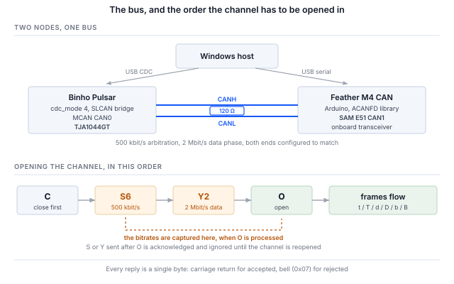

## 1 Introduction

The Binho Pulsar is a USB host adapter for I2C, SPI, UART and GPIO. It also
carries an NXP MCAN controller and a TJA1044GT CAN-FD transceiver, and from
firmware v4.4.0 its USB virtual COM port can be put into a mode that bridges
that transceiver to the host using **SLCAN**, the ASCII serial CAN protocol
originally from Lawicel and now spoken by a wide range of adapters and tools.

That last part is what makes this worth a document. The Pulsar's Python SDK has
no CAN commands at all, and none are needed: in CAN-FD mode the device behaves
as a conventional SLCAN adapter, so the existing CAN software ecosystem drives
it unchanged.

Table: What CAN-FD adds to classic CAN

| Feature | What it gives a design |
|---|---|
| 64-byte payloads | Eight bytes becomes sixty-four, so a record that classic CAN has to fragment across frames and reassemble fits in one |
| Bit-rate switching | The arbitration phase stays at a rate every node can follow while the data phase runs faster, because only one node is driving by then |
| Larger DLC encoding | DLC values 9 to F select 12, 16, 20, 24, 32, 48 and 64 bytes, so payloads above 8 are addressed by a step table rather than a byte count |
| Stronger frame check | A CRC sized to the payload, with a stuff-bit count, rather than the single 15-bit polynomial classic CAN uses for every length |
| Unchanged physical layer | The same two wires, the same transceivers, the same 120 Ω termination |
| Coexistence | Classic and FD frames share a bus, and a frame is classic or FD per frame rather than per bus |

Three properties of this setup determine how a host is written, and all three
differ from the other adapters in this series.

Table: What differs from the other Binho host adapters

| Property | Consequence for the host |
|---|---|
| CAN-FD is a CDC mode, not an SDK command group | The mode is selected over HID and stored in flash, then the device is a dedicated SLCAN bridge. While it is, the I2C, SPI, UART and GPIO managers do not run |
| The interface is a serial line protocol | Commands are ASCII terminated by carriage return, and the device answers `\r` for accepted and `\a` for rejected. That is diagnosable with a terminal, with no library in the way |
| The host is one node on a shared bus | Unlike a point-to-point bus, frames appear unbidden, need acknowledging by somebody, and arrive while the host is busy elsewhere. Sections 8.2 and 13 are both consequences of that |

This note works through a Pulsar and a second CAN-FD node built for the
purpose: switching the Pulsar into CAN-FD mode, the SLCAN protocol it speaks,
building and bringing up the far-end node, proving classic and FD traffic in
both directions, then driving the bus from python-can and the stacks built on
it.

Nothing here requires a bespoke SDK. Every host-side step is either a line of
ASCII on a serial port or a call into software that was already on the shelf.

### 1.1 Scope

By the end of this document a reader with the hardware in front of them will
have switched a Pulsar into CAN-FD mode, confirmed the bridge answers SLCAN,
built a second CAN-FD node and matched its bit timing to the adapter, exchanged
classic and 64-byte FD frames with bit-rate switching in both directions,
decoded live traffic through a DBC, captured and replayed a log, and driven the
bus from the CANopen, J1939 and ISO-TP stacks.

The worked example pairs a Pulsar with an Adafruit Feather M4 CAN Express. Both
are exercised on hardware and every output in this document is a real capture.

This note covers Windows-native host tooling. The `can-utils` and SocketCAN
family, which is how the same tools are usually reached on Linux, is out of
scope: on Windows it needs a USB passthrough layer and a Linux environment, and
neither is required to use the adapter.

### 1.2 Applicable devices

CAN-FD mode is **Pulsar only**. The Binho Supernova's microcontroller has no
MCAN peripheral, and its firmware rejects the mode. The host-side material
applies to any SLCAN adapter; the node firmware applies to any board built on
a SAM E51 with its CAN1 pins brought out.

### 1.3 Related documents

Table: Related documents

| Document | Where |
|---|---|
| CDC CAN-FD (SLCAN) mode | Binho firmware documentation, `docs/CDC-CANFD-Mode.md`; the authority on the bridge's command set and limits |
| Binho Pulsar documentation | `https://support.binho.io` |
| python-can | `https://python-can.readthedocs.io` |
| cantools | `https://cantools.readthedocs.io` |
| ACANFD_FeatherM4CAN | `https://github.com/pierremolinaro/acanfd-featherM4can`, the CAN-FD driver used for the node |
| CAN FD specification | Robert Bosch GmbH, *CAN with Flexible Data-Rate*, v1.0 |
| ISO 11898-1 | CAN data link layer, including the FD frame format |

## 2 Required equipment and software

### 2.1 Hardware

Table: Required equipment

| Item |
|---|
| Binho Pulsar, on firmware v4.4.0 or later |
| Adafruit Feather M4 CAN Express, or another CAN-FD node |
| Two-wire CAN link between the two, CANH to CANH and CANL to CANL |
| 120 Ω termination |
| Two USB-C cables |

### 2.2 Connections

Table: Signals used

| Signal | Purpose |
|---|---|
| CANH | CAN bus, dominant-high line |
| CANL | CAN bus, dominant-low line |
| GND | Common return between the two boards |

The Pulsar's CANH and CANL come from its onboard TJA1044GT; the Feather's come
from the transceiver on that board. No third wire is needed, and neither board
supplies the other.

> **Note:** CAN needs termination, and it needs a second node. A bus with one
> talker and no acknowledger does not half-work: the transmitter never sees an
> acknowledgement, retries the frame indefinitely, and its transmit queue backs
> up behind the first frame it ever sent. Section 14 lists what that looks like
> from each end, since the symptom points at the adapter rather than the bus.

### 2.3 Bus settings

Table: Bus settings used

| Setting | Value | Set by |
|---|---|---|
| Arbitration bitrate | 500 kbit/s | SLCAN `S6`, and `DataBitRateFactor` base on the node |
| Data-phase bitrate | 2 Mbit/s | SLCAN `Y2`, and `DataBitRateFactor::x4` on the node |
| Termination | 120 Ω | Hardware |
| Serial port rate | irrelevant | See below |

The COM port's baud rate does not matter. The port is a USB CDC endpoint
rather than a real UART, so the number is discarded; the CAN bitrate comes from
the `S` and `Y` commands and nothing else.

### 2.4 Software

```
pip install python-can cantools
```

Python 3.12 with `python-can` and `cantools` covers everything in Sections 8
and 9. Section 10 adds `canopen`, `can-j1939` and `can-isotp`. Switching the
CDC mode needs `hidapi`.

For the node firmware, the Arduino toolchain with the Adafruit SAMD core and
one library:

```
arduino-cli core install adafruit:samd \
  --additional-urls https://adafruit.github.io/arduino-board-index/package_adafruit_index.json
arduino-cli lib install ACANFD_FeatherM4CAN
```

> **Note:** on Windows, install the core into the default Arduino location.
> The GCC toolchain reaches about 130 characters of path depth on its own, and
> a data directory placed somewhere deep pushes `cc1plus.exe` past the 260
> character limit. The failure is `cannot execute 'cc1plus'`, which does not
> look like a path problem.

## 3 Switching the Pulsar into CAN-FD mode

CAN-FD is one of several functional modes for the USB virtual COM port. The
mode is set over HID and stored in flash, so it survives a power cycle, and the
firmware's own tool applies it:

```
python device_settings_cli.py --device pulsar show
```

```
Connected to Binho Pulsar
  webusb_enabled : 1  (on)
  cdc_enabled    : 1  (on)
  cdc_mode       : 0  (uart_passthrough)
```

Mode 0 is the default, a transparent USB-to-UART bridge. That is worth knowing
before anything else, because a Pulsar in the default mode presents a COM port
that answers no SLCAN command and produces no output. It is not faulty and it
is not the wrong port; it is bridging a UART.

```
python device_settings_cli.py --device pulsar set --cdc-mode canfd
```

```
Settings updated:
  cdc_mode       : 4  (canfd)

Resetting device to persist settings to flash...
```

The reset is expected: the mode is applied at boot, so the tool restarts the
device to make the setting take effect. The Pulsar then re-enumerates, and the
COM port it comes back as is the SLCAN interface.

Two consequences follow from the mode being exclusive.

While the Pulsar is in CAN-FD mode the **HID protocol managers do not run**.
I2C, SPI, UART and GPIO are unavailable until the mode is changed back; the
device is a dedicated SLCAN bridge. Settings commands still work over HID,
which is how the mode is changed back:

```
python device_settings_cli.py --device pulsar set --cdc-mode uart_passthrough
```

And because the setting is in flash, a Pulsar left in CAN-FD mode comes back
in CAN-FD mode. If a unit appears to have lost its I2C and SPI, this is the
first thing to check.

## 4 The SLCAN protocol

### 4.1 Command set

Commands are ASCII, one per line, terminated by a carriage return. The device
answers `\r` (0x0D) when it accepts a command and `\a` (0x07, bell) when it
does not. That makes the whole interface reachable from a terminal, which is
the right place to start when something is not working.

Table: SLCAN commands

| Command | Meaning | Notes |
|---|---|---|
| `S0`–`S8` | Select arbitration bitrate | Captured when the channel opens |
| `Y1`, `Y2`, `Y5` | Select CAN-FD data-phase bitrate | Captured when the channel opens |
| `O` | Open the channel, normal mode | |
| `L` | Open the channel, listen-only | Does not acknowledge; see Section 13 |
| `C` | Close the channel | Transceiver goes to standby |
| `t` / `T` | Transmit classic frame, standard / extended ID | |
| `d` / `D` | Transmit FD frame without bit-rate switching | |
| `b` / `B` | Transmit FD frame with bit-rate switching | |
| `V`, `N`, `F` | Version, serial number, status flags | Fixed constants in this firmware |
| `s` | Custom bit timing | Accepted and ignored; use `S` |

Confirming the bridge answers, before involving any library:

```
python canfd_slcan.py probe --port COM12 --bitrate 500000 --data-bitrate 2000000
```

```
  V   -> b'V0101\r'   ok   version
  N   -> b'NFFFF\r'   ok   serial number
  F   -> b'F00\r'     ok   status flags
  S6  -> b'\r'        ok   nominal 500000
  Y2  -> b'\r'        ok   data phase 2000000
  Q   -> b'\x07'      ok   an unsupported command should bell
```

The last line matters as much as the others. A device that answered everything
identically would prove nothing; one that bells an unknown command is
parsing.

`V`, `N` and `F` return constants rather than live values, so they prove the
bridge is listening, not which device it is or what state the bus is in.

### 4.2 Frame format

A transmit frame is one string:

```
<letter><identifier><dlc><data bytes>
```

The letter carries three facts at once. Whether the frame is classic (`t`) or
FD (`d`, `b`); whether the data phase switches rate, which is `b` and `B` but
not `d` and `D`; and whether the identifier is standard, which is lowercase, or
extended, which is uppercase. The identifier is three hex digits for standard
and eight for extended, the DLC is one hex digit, and the data follows as byte
pairs.

Received frames arrive in the same shape, unsolicited, once the channel is
open.

```
t1238DEADBEEF00112233       classic, std 0x123, 8 bytes
b200F0102...                FD with BRS, std 0x200, DLC F = 64 bytes
```

### 4.3 Bitrates and the DLC mapping

Table: DLC to payload length

| DLC | 0–8 | 9 | A | B | C | D | E | F |
|---|---|---|---|---|---|---|---|---|
| Bytes | 0–8 | 12 | 16 | 20 | 24 | 32 | 48 | 64 |

Above 8 bytes, payload lengths come from that step table rather than being
free. A 20-byte payload is DLC `B`; a 13-byte payload does not exist and has to
be padded to 16. The supplied utility pads automatically, which is a decision
worth making explicit somewhere rather than leaving a caller to wonder why
their 13 bytes became 16.

Bitrates are captured when the channel opens. **Send `S` and `Y` before `O`.**
Setting them afterwards is accepted and acknowledged and has no effect until
the channel is closed and reopened, which is the sort of failure that looks
like a bit-timing problem rather than an ordering one.



## 5 The far-end node

A CAN bus needs a second participant, both to acknowledge frames and to have
anything worth looking at. The node used here is an Adafruit Feather M4 CAN
Express, which pairs a SAM E51 with a CAN-FD transceiver, programmed in
Arduino C++ with the `ACANFD_FeatherM4CAN` library.

> **Note:** CircuitPython's `canio` module was measured on this board and is
> **classic CAN only**: `Message` accepts at most 8 bytes, and the constructor
> rejects `fd`, `can_fd` and `data_bitrate`. The MCAN peripheral itself does FD,
> and a `canio` loopback confirms the controller works, but FD is not exposed.
> A CAN-FD node on this board therefore has to be built in C++.

### 5.1 Which CAN module, and the two pins that decide whether it works

The SAM E51 has two CAN modules and the board wires **CAN1** to the onboard
transceiver. CAN1 is the only one whose CANH and CANL reach the header; CAN0
exists, on D12 and D13, with nothing behind it.

Two pins decide whether a correctly configured node ever drives the bus. The
transceiver has a standby input that must be driven low to make it active, and
a boost converter enable that must be driven high. Left alone, both leave a
node that configures without error, reports successful transmissions, and puts
nothing on the wire.

The library handles both inside `beginFD` for CAN1, driving PB12 low and PB13
high. That is worth knowing rather than assuming: on a board where it is not
handled, this is the first thing to check.

### 5.2 Matching the bit timing

The node expresses its data-phase rate as a **multiple** of the arbitration
rate, not as an absolute figure:

```cpp
ACANFD_FeatherM4CAN_Settings settings(
    ACANFD_FeatherM4CAN_Settings::CLOCK_48MHz, 500 * 1000, DataBitRateFactor::x4);
settings.mModuleMode = ACANFD_FeatherM4CAN_Settings::NORMAL_FD;
const uint32_t errorCode = can1.beginFD(settings);
```

500 kbit/s with a factor of four is 2 Mbit/s, which is SLCAN `S6` then `Y2`.
Both ends have to agree before either opens its channel.

`beginFD` returns non-zero if it cannot find bit timing for the requested
combination, and the node reports that rather than continuing, because a node
that silently ran at the wrong rate would be harder to diagnose than one that
refused.

### 5.3 Resending a received frame

The one non-obvious defect worth documenting. `CANFDMessage` has an `idx`
field that belongs to the driver, and on a received frame it holds the index
the frame arrived under. Copying a received frame to echo it therefore carries
a non-zero `idx`, which the transmit path reads as *use dedicated transmit
buffer number idx*, a buffer that does not exist:

```cpp
CANFDMessage reply = frame;   // carries frame.idx
reply.id  = RESPONSE_ID;
reply.idx = 0;                // without this, status 2 and nothing on the bus
```

The symptom is a transmit status of 2, `kTransmitBufferIndexTooLarge`, and no
frame. Zero means *use the transmit FIFO*, which is what an echo wants.

## 6 First traffic

With both ends at matching rates, the node's own console shows it configuring
and transmitting:

```
=== Feather M4 CAN :: CAN-FD test node ===
arbitration 500000 bit/s, data x4 = 2000000 bit/s   (SLCAN: S6 then Y2)
CAN1 configured, transceiver active
diagnostic: 0x100 heartbeat, 0x200 ramp, 0x123->0x321 echo
device:     0x110 environment, 0x210 trace, 0x600->0x601 cmd
```

And from the host, opening the channel and listening:

```
python canfd_slcan.py listen --port COM12 --bitrate 500000 --data-bitrate 2000000
```

```
  channel open (normal), 500000 nominal, 2000000 data; collecting for 4 s
   id=0x100 classic len=8   x8
   id=0x110 classic len=8   x17
   id=0x200 fd+brs  len=64  x4
   id=0x210 fd+brs  len=48  x21
  50 frame string(s), 50 decoded, 4 distinct
```

Two of those are the reason for doing any of this. `0x200` is a 64-byte frame
with bit-rate switching, and `0x210` is a 48-byte one; neither can be received
by a classic-CAN host at all. A tool that shows them is genuinely doing FD
rather than reporting that it does.

The reverse direction, and the FD round trip:

```
python canfd_slcan.py roundtrip --port COM12 --bitrate 500000 --data-bitrate 2000000
```

```
  --- classic ---
    drained 9 buffered frame(s) first
    reply id=0x321 classic dlc=8 len=8
    payload identical: True

  --- CAN-FD, 64 bytes, BRS ---
    drained 0 buffered frame(s) first
    reply id=0x321 fd+brs dlc=64 len=64
    payload identical: True
```

The FD request came back as an FD reply with bit-rate switching preserved and
the payload byte-identical. That is the assertion a transmit test cannot make:
it proves the far end received what was sent, and that nothing downgraded the
frame on the way through.

## 7 The demo node's message catalogue

The node is deliberately two things at once, and the split is worth keeping in
any test node.

The **diagnostic layer** exists to prove the bus works, and does as little as
possible so that when it fails the cause is narrow.

Table: Diagnostic messages

| ID | Frame | Rate | Contents |
|---|---|---|---|
| `0x100` | classic, 8 bytes | 500 ms | Sequence number and receive counters |
| `0x200` | FD with BRS, 64 bytes | 1 s | A byte ramp |
| `0x123` → `0x321` | follows the request | on demand | Echo, preserving frame type and BRS |

The **device layer** sits on top and exists so a host has something worth
decoding. None of it is needed to diagnose the bus.

Table: Simulated device messages

| ID | Frame | Rate | Contents |
|---|---|---|---|
| `0x110` | classic, 8 bytes | 100 ms, changeable | Temperature, humidity, pressure, flags, sequence |
| `0x210` | FD with BRS, 48 bytes | 200 ms | A 16-sample waveform trace with a header |
| `0x600` → `0x601` | classic, 8 bytes | on demand | `INFO`, `COUNTERS`, `SET_RATE` |

`0x210` is the message that argues *for* CAN-FD rather than merely exercising
it. Sixteen 16-bit samples behind a 12-byte header is 44 bytes in one frame.
The same trace over classic CAN is six frames plus a reassembly scheme, and
those six frames interleave with everything else on the bus, so the receiver
also needs to handle them arriving out of order or incomplete.

Decoded from the wire:

```
python canfd_slcan.py monitor --port COM12 --bitrate 500000 --data-bitrate 2000000
```

```
   0x100  heartbeat seq=11024 rx=10 echoes=0
   0x110  environment 19.7 C  49.1 %RH  1012.7 hPa  flags=0x01 seq=212
   0x200  fd ramp 64 bytes, first=0x88
   0x210  trace seq=27560 uptime=5515031 ms  16 samples peak=7998  [7331, 5548, 2921, -151, -3200, -5762, ...]
```

The command endpoint answers on `0x601`, echoing the command byte in the first
position so a reply matches its request without needing a transaction
identifier:

```
python canfd_slcan.py command info --port COM12 --bitrate 500000 --data-bitrate 2000000
```

```
  TX t600101   (info)
  RX 0x601  cmd INFO  id=BIN fw=1.0 features=0x07 trace_samples=16
```

`SET_RATE` is worth a word because it demonstrates something a read-only
catalogue cannot. It clamps the requested period rather than rejecting it, and
returns the value that actually took effect:

```
  TX t6003036400   (set-rate)
  RX 0x601  cmd SET_RATE period=100 ms, accepted
```

Setting 250 ms and then listening shows `0x110` at 17 frames in four seconds
rather than about 40, so the command changed behaviour rather than only being
acknowledged.

All multi-byte fields are **little-endian**. CAN itself imposes no byte order,
so this is a choice, and one that has to be written down or the two ends
quietly disagree.

## 8 Driving the bus from python-can

The bridge is an ordinary SLCAN adapter to python-can, through its stock
interface and with no Binho-specific code:

```python
import can

bus = can.Bus(interface="slcan", channel="COM12", bitrate=500_000)
bus.set_bitrate(500_000, 2_000_000)      # nominal, then FD data phase

bus.send(can.Message(arbitration_id=0x123, is_extended_id=False,
                     data=bytes(range(64)), is_fd=True, bitrate_switch=True))
print(bus.recv(timeout=1.0))
bus.shutdown()
```

### 8.1 Why `set_bitrate` works, and a constructor alone does not

The FD data-phase rate cannot be passed to the constructor. `set_bitrate` is
the route, and it works because of what it does internally: it closes the
channel, writes `S` and `Y`, and reopens. That is exactly the ordering
Section 4.3 requires. Setting the rates on an already-open channel would be
accepted and ignored.

Table: python-can bitrate mapping

| Asked for | Sent | Bus runs at |
|---|---|---|
| 500 000 | `S6` | 500 kbit/s |
| 1 000 000 | `S8` | 1 Mbit/s |
| 750 000 | `S7` | **800 kbit/s** |
| data 2 000 000 | `Y2` | 2 Mbit/s |
| data 5 000 000 | `Y5` | 5 Mbit/s |

The third row is a trap. python-can's table maps 750 000 to `S7`, and this
firmware's `S7` is 800 kbit/s. Asking for 750 kbit/s puts the bus at 800
kbit/s with no warning from either side. The backend also offers only 2 and 5
Mbit/s for the data phase, so `Y1` is reachable from the raw protocol but not
through that interface.

### 8.2 The backlog, and why a request/response test needs draining

This one costs real time. The node transmits continuously, and the bridge keeps
buffering while the host spends its two-second port settle and its channel
close-and-reopen. By the time a request goes out there is a queue of unrelated
frames ahead of its reply.

A loop that sends and then reads the next few frames reads *history*. The reply
is there, behind the backlog, and a working node looks like it never answered.
Draining first is what makes the measurement mean anything:

```
  --- classic request/response ---
    drained 42 buffered frame(s) first
    reply id=0x321 classic dlc=8 len=8 data=DEADBEEF00010203
```

Forty-two frames of history in that instance. Without the drain, the same test
reported no reply at all from a node that had answered correctly.

### 8.3 Logging and replay

python-can installs command-line tools that cover the capture and replay
workflow:

```
python -m can.logger -i slcan -c COM12 -b 500000 --fd --data-bitrate 2000000 -f capture.asc
python -m can.player -i slcan -c COM12 -b 500000 --fd --data-bitrate 2000000 capture.asc
```

The log is a Vector ASC file with correct FD records, the `f 64` being DLC F
and its byte count:

```
 0.000000 1  100             Rx   d 8 00 00 07 6E 00 07 00 07
 0.000000 CANFD   1 Rx        200   1 0 f 64 B7 B8 B9 BA BB BC ...
```

Replaying it put the frames back on the wire, and the node received them: 17
copies of `0x100` and 13 of `0x200`.

> **Note:** every timestamp in that capture reads `0.000000`. The firmware does
> not implement the SLCAN timestamp commands (`Z0`/`Z1`), so there is nothing
> for python-can to record. The log is structurally valid and its FD records
> are correct, but it carries no timing information. Anything that needs
> inter-frame timing has to take it from the host instead.

## 9 Decoding with a DBC

A DBC turns raw bytes into named, scaled signals, and it is the most common CAN
workflow there is. `cantools` reads one and decodes live traffic:

```python
import can, cantools

db = cantools.database.load_file("binho_canfd_demo.dbc")
bus = can.Bus(interface="slcan", channel="COM12", bitrate=500_000)
bus.set_bitrate(500_000, 2_000_000)

message = bus.recv(timeout=1.0)
print(db.decode_message(message.arbitration_id, message.data))
```

```
  0x100 Heartbeat        Seq=7787, RxCount=4, EchoCount=0
  0x110 Environment      Temperature=20.3, Humidity=42.4, Pressure=1014.2, Flags=1, EnvSeq=159
  0x200 FdRamp           FirstByte=53
  0x210 Telemetry        TraceSeq=19469, UptimeMs=3896831, SampleCount=16, Reserved=0, Sample00=-3434, ...
```

The supplied DBC describes all seven messages and 33 signals. It is generated
from a script rather than hand-written, for two reasons worth repeating: the
trace has sixteen signals whose bit offsets invite an off-by-one, and a DBC
with a one-bit slip decodes to plausible nonsense rather than failing.

> **Note:** a DBC must mark its FD messages, or a reader treats a 48- or
> 64-byte message as a malformed classic frame. The attribute is
> `VFrameFormat`, set to `StandardCAN_FD`. `cantools` reads it but does not
> write it, so a DBC produced by dumping a database loses the flag; the
> supplied generator appends it and then reloads the file to confirm it
> survived.

The `cantools` command line covers the rest of the workflow without any code:

Table: cantools subcommands

| Command | What it does |
|---|---|
| `dump` | Prints each message with a bit-layout diagram |
| `decode` | Decodes candump-format text through the DBC |
| `monitor` | Live decoded view, curses based |
| `plot` | Plots decoded signals over time |
| `convert` | Between DBC, KCD, SYM, ARXML |
| `generate_c_source` | Emits C encoders and decoders for the embedded side |

```
python -m cantools decode binho_canfd_demo.dbc < candump.log
```

```
  can0  210   [48]  0E 4C 00 00 C7 76 3B 00 10 00 00 00 03 F4 ... ::
Telemetry(
    TraceSeq: 19470,
    UptimeMs: 3897031 ms,
    SampleCount: 16,
    Sample00: -3069,
    Sample01: -8,
    ...
)
```

> **Note:** `decode` and `plot` consume **candump** text, while `can.logger`
> writes **ASC**. Those two formats do not interoperate directly, so a capture
> intended for `cantools` has to be written in candump format. This is a seam
> in the tooling rather than a limitation of the adapter.

## 10 Higher-level stacks

Because the bridge is an ordinary SLCAN adapter, the protocol stacks built on
python-can work over it unchanged. Each of the following was checked by asking
the stack to transmit and confirming at the *node* that the frame reached the
wire, rather than by observing that the library accepted the call.

Table: Stacks verified over the bridge

| Stack | What it sent | Seen at the node |
|---|---|---|
| `canopen` | NMT reset, the broadcast a CANopen master opens with | `0x000` |
| `can-j1939` | Address claim, PGN `0xEE00` carrying the 8-byte NAME | `0x18EEFF80`, extended |
| `can-isotp` | A 60-byte ISO-TP single frame over CAN-FD | `0x700` |

```python
import canopen
network = canopen.Network()
network.connect(interface="slcan", channel="COM12", bitrate=500_000)
network.nmt.state = "RESET"
network.disconnect()
```

The ISO-TP case is the interesting one, and it is another argument for FD.
Configured with a 64-byte transmit length, ISO-TP carries a payload up to 62
bytes in a **single frame**, which needs no flow control and therefore no
cooperating peer to demonstrate:

```python
import can, isotp
bus = can.Bus(interface="slcan", channel="COM12", bitrate=500_000)
bus.set_bitrate(500_000, 2_000_000)
stack = isotp.CanStack(
    bus=bus,
    address=isotp.Address(isotp.AddressingMode.Normal_11bits, txid=0x700, rxid=0x701),
    params={"tx_data_length": 64, "can_fd": True, "bitrate_switch": True})
stack.start()
stack.send(bytes(range(60)))
```

The same 60 bytes over classic CAN is a first frame, eight consecutive frames
and a flow-control handshake. That transport is what UDS runs on, so
`udsoncan` follows the same path; a full diagnostic session needs a peer that
implements an ISO-TP server, which the demo node deliberately does not.

## 11 Measured results

### 11.1 Test configuration

Table: Test configuration

| Item | Value |
|---|---|
| Adapter | Binho Pulsar, hardware rev C, firmware 4.5.0, `cdc_mode` 4 |
| Node | Adafruit Feather M4 CAN Express, SAM E51, `ACANFD_FeatherM4CAN` 2.0.0 |
| Node firmware size | 23,484 bytes, 4% of flash |
| Bus | 500 kbit/s arbitration, 2 Mbit/s data phase, 120 Ω terminated |
| Host | Windows 11, Python 3.12, python-can 4.6.1, cantools 43.0.2 |

### 11.2 What the bridge implements

Table: Verified behaviour

| Feature | Result |
|---|---|
| Classic frames, standard ID | Yes, both directions |
| CAN-FD frames, up to 64 bytes | Yes, both directions, payload verified byte-identical |
| Bit-rate switching | Yes, per frame, and preserved through an echo |
| Extended identifiers | Yes; observed on the J1939 address claim, `0x18EEFF80` |
| Arbitration bitrates | `S0`–`S8` |
| Data-phase bitrates | `Y1`, `Y2`, `Y5` |
| Listen-only mode | Yes, `L`; see the caution in Section 13 |
| Unknown command handling | Bell, `0x07` |
| Receive timestamps | Not implemented; every logged timestamp is zero |
| Error and bus-state reporting | Not implemented; `F` returns a constant |
| Remote transmission requests | Not supported |
| Host-side acceptance filtering | Not implemented; all identifiers are received |

### 11.3 Host software verified

Table: Host software driven over the bridge

| Software | Verified |
|---|---|
| python-can 4.6.1, `slcan` | Classic and FD transmit and receive, FD round trip |
| `can.logger` | ASC capture with correct FD records |
| `can.player` | Replay onto the bus, received at the node |
| cantools 43.0.2 | DBC decode of live frames; `dump`, `decode` |
| canopen 2.4.1 | NMT broadcast on the bus |
| can-j1939 2.0.12 | Address claim on the bus |
| can-isotp 2.0.7 | 60-byte single frame over FD |
| udsoncan 1.26.1 | Installed; rides on can-isotp, needs an ISO-TP peer |
| canmatrix 1.2 | Installed; database conversion, no bus involved |

## 12 The reference material

Table: What is supplied

| File | Purpose |
|---|---|
| `assets/canfd_node/canfd_node.ino` | The CAN-FD node firmware |
| `assets/tools/canfd_slcan.py` | Host utility, eight subcommands |
| `assets/tools/device_settings_cli.py` | Switches the Pulsar's CDC mode |
| `assets/dbc/binho_canfd_demo.dbc` | DBC for the node's seven messages |
| `assets/dbc/generate_dbc.py` | Generates and self-checks that DBC |

The utility keeps two layers apart on purpose.

`probe`, `listen`, `send`, `monitor` and `command` speak SLCAN over the serial
port with no CAN library involved. That is the layer where a problem is
diagnosable, because the exact ASCII sent and the exact `\r` or `\a` returned
are both visible.

`roundtrip` goes through python-can's stock interface instead, which is how a
reader will actually use the adapter. Running both against the same hardware
localises a fault: if the raw layer works and the library layer does not, the
fault is in how the library is being driven.

Table: Utility subcommands

| Command | What it does |
|---|---|
| `mode` | How to switch the CDC mode, and what that costs |
| `probe` | Check the bridge answers SLCAN |
| `rates` | The bitrate tables and the DLC mapping |
| `listen` | Decode frames off the bus, by identifier |
| `send` | Transmit one frame, classic or FD, with optional BRS |
| `monitor` | Decode the demo node's catalogue into engineering units |
| `command` | Send `INFO`, `COUNTERS` or `SET_RATE` and decode the reply |
| `roundtrip` | Request and response through python-can, classic and FD |

## 13 Practical notes

**Send `S` and `Y` before `O`.** Bitrates are captured when the channel opens.
Setting them afterwards is accepted, acknowledged, and ineffective until the
channel is closed and reopened.

**Drain before a request/response measurement.** The bridge buffers bus traffic
while the host is opening the port and cycling the channel, so a reply sits
behind a backlog. Reading the next few frames after sending reads history.

**Listen-only mode cannot be the only other node.** `L` opens a channel that
never acknowledges. On a two-node bus that is fatal to the peer: nothing
acknowledges its frames, the controller retries them indefinitely, and it never
advances past the first frame it sent. The symptom is thousands of copies of
one message and nothing else. Use `L` only where a third node acknowledges.

**Clear `idx` when resending a received frame.** On the node side, a copied
receive descriptor carries the driver's own index and the transmit path reads
it as a dedicated buffer number.

**Parse received frame strings defensively.** A read window routinely opens
mid-frame, so the first string out of the buffer is often a tail with no
leading letter or an odd number of hex digits. That is normal, and a decoder
that raises on it will stop a monitor that was working.

**A Pulsar in CAN-FD mode has no I2C, SPI, UART or GPIO,** and the setting
persists across power cycles. If those interfaces appear to have vanished,
check `cdc_mode` first.

**Padding is not optional above 8 bytes.** FD lengths come from a step table,
so a 13-byte payload has to be padded to 16.

## 14 Troubleshooting

Table: Troubleshooting

| Symptom | Likely cause |
|---|---|
| The COM port answers nothing, no banner, no bell | The Pulsar is in `uart_passthrough` mode; it is bridging a UART, not speaking SLCAN |
| Every command returns a bell | Malformed command, or a transmit attempted while the channel is closed or listen-only |
| Commands accepted but no frames ever arrive | Channel not opened with `O`, bitrate mismatch between the ends, missing termination, or CANH and CANL swapped |
| Thousands of copies of one identifier, nothing else | The adapter was opened with `L`; the peer's frames are unacknowledged and being retried forever |
| Node reports transmit status 2 | A received frame was resent without clearing `idx` |
| Node reports transmit status 3 | Its queue is full because nothing is acknowledging: peer channel closed, or termination missing |
| Bitrate change appears ignored | `S` or `Y` sent after `O`; close and reopen |
| Asked for 750 kbit/s, bus runs at 800 | python-can maps 750 000 to `S7`, which is 800 kbit/s in this firmware |
| Request/response reports no reply, but the node logged one | The reply was behind the receive backlog; drain before sending |
| Logged timestamps are all zero | The firmware does not implement `Z0`/`Z1`; take timing from the host |
| A DBC decodes 48- or 64-byte messages as malformed | The DBC is missing `VFrameFormat` on those messages |
| `cannot execute 'cc1plus'` when building the node | Windows path length; install the Arduino core at its default location |
| The node configures but never drives the bus | Transceiver standby not asserted, or its boost converter not enabled |

## 15 Acronyms

Table: Acronyms

| Term | Meaning |
|---|---|
| BRS | Bit-rate switch |
| CAN | Controller Area Network |
| CAN-FD | CAN with Flexible Data-rate |
| CDC | Communications Device Class, the USB serial-port class |
| DBC | Vector database format for CAN networks |
| DLC | Data length code |
| ECU | Electronic control unit |
| FD | Flexible Data-rate |
| HID | Human Interface Device, the USB class the SDK uses |
| ISO-TP | ISO 15765-2 transport protocol |
| MCAN | The Bosch M_CAN controller licensed into many microcontrollers |
| NMT | Network management, a CANopen service |
| PGN | Parameter group number, a J1939 identifier |
| RTR | Remote transmission request |
| SLCAN | Serial line CAN, the ASCII adapter protocol |
| UDS | Unified Diagnostic Services, ISO 14229 |

## 16 Note about the source code in the document

Example code shown in this document and supplied in the accompanying archive is
provided for evaluation and reference. It is released under the MIT license,
the text of which is included in the archive.

`device_settings_cli.py` is Binho's own firmware tool, included so the mode
switch in Section 3 can be reproduced without a separate download. The node
firmware depends on the `ACANFD_FeatherM4CAN` library by Pierre Molinaro, which
is installed from the Arduino library manager and is not redistributed here.

Table: Contents of the assets archive

| File | Description |
|---|---|
| `AN0012.md` | Markdown source of this document |
| `assets/canfd_node/canfd_node.ino` | CAN-FD node firmware for the Feather M4 CAN Express |
| `assets/tools/canfd_slcan.py` | Host utility for the SLCAN bridge |
| `assets/tools/device_settings_cli.py` | CDC mode switching over HID |
| `assets/dbc/binho_canfd_demo.dbc` | DBC describing the node's messages |
| `assets/dbc/generate_dbc.py` | Generator for that DBC |
| `assets/LICENSE` | MIT license covering the example code |

## 17 Revision history

Table: Revision history

| Revision | Date | Description |
|---|---|---|
| 0.1 | 9 September 2026 | Draft for internal review. Written as AN0008 and renumbered to AN0012 before review; no change to any measurement. Every result was taken on a Pulsar at firmware 4.5.0 against a purpose-built CAN-FD node, with the host tooling limited to what runs natively on Windows. |
