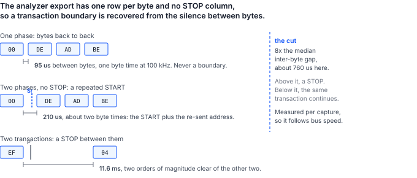

## 1 Introduction

An engineer with a working system and a logic analyzer has, in the capture file, an exact record
of a bus exchange that worked. The natural next question is whether that record can be replayed.

This document answers it for I2C with a Binho Pulsar. It supplies the utility that does the
replay, the procedure that produced every number below, and an account of the ways a replay
legitimately diverges from its capture. The divergences are the substance: sending the bytes
again is the easy half.

### 1.1 Scope

This document covers:

- reading a Saleae I2C analyzer CSV export and recovering transactions from it
- replaying those transactions from a Pulsar or a Supernova, in Python or in C++
- what the adapter reports when a target refuses, and what it does not report
- establishing on the wire, with the analyzer watching both runs, that the replay matches
- provoking a refusal deliberately, using a second adapter as an emulated target
- the limits: reads, transaction framing, timing, silent refusals and ten-bit addressing

It does not cover replaying SPI, I3C or UART captures, driving a replay from Mission Control 3,
or reconstructing a capture from an analyzer session file. The utility reads the analyzer's CSV
export, not its native session.

### 1.2 Applicable devices

Table: Applicable devices

| Role | Part | Identifier | Basis |
|---|---|---|---|
| Replay controller | Binho Pulsar | hardware revision C, firmware 4.4.0 | measured, this document |
| Replay controller | Binho Supernova | hardware revision C, firmware 4.5.0 | the code path is shared with the Pulsar; not separately measured as the controller |
| Emulated target | Binho Supernova as an I2C target | hardware revision C, firmware 4.5.0 | measured, this document |
| Capture instrument | Saleae Logic Pro 8 | Logic 2 v2.4.46, I2C analyzer | measured, this document |
| Capture instrument | Acute TravelBus | 8 channels | decodes the same bus; its export is not read by the utility |

### 1.3 Related documents

Table: Related documents

| Document | Title |
|---|---|
| AN0002 | Programming STM32 microcontrollers over I2C with the Binho Pulsar |
| AN0008 | Bringing up a CMIS optical module over I2C with the Binho Supernova |

## 2 Required equipment and software

### 2.1 Hardware

Table: Required equipment

| Item |
|---|
| Binho Pulsar USB host adapter, as the replay controller |
| Logic analyzer with an I2C decoder |
| I2C target to replay against |
| Second Binho adapter, to act as an emulated target for section 4.5 |
| USB-C cables |

Either analyzer in section 1.2 decodes this bus. The measurements here were taken with a Saleae
Logic Pro 8 because the utility reads that analyzer's export directly; an Acute TravelBus
resolves the same traffic and decodes I2C in its own software, but its export is a different
file, and getting a capture from it into this utility means writing the six columns of section
4.2 out of whatever the instrument produces. The procedure assumes the Saleae for that reason
alone.

### 2.2 Connections

Table: Signals used

| Signal | Purpose |
|---|---|
| SCL | I2C clock, controller to target and to the analyzer probe |
| SDA | I2C data, bidirectional, and to the analyzer probe |
| 3.3 V | Target supply, from the controlling adapter |
| GND | Return, common to both adapters and the analyzer |

One bus, and **exactly one controller on it**. Where a second adapter acts as the emulated
target, its own I2C controller is never initialized: two initialized controllers on one bus both
drive SCL and SDA and both energize the shared target rail, which produces a scan asymmetry and
a wrong voltage read-back that look like a miswired cable.

The analyzer probes the same two signals. Channel assignment is a choice, but it has to be
declared to the decoder and it is worth confirming rather than assuming: decoding with SCL and
SDA transposed produces plausible output rather than an error.

### 2.3 Bus settings

Table: Bus settings used

| Setting | Value |
|---|---|
| Bus | Pulsar bus A, the Qwiic port |
| Clock | 100 kHz |
| Pull-up | 2.2 kOhm, from the controlling adapter only |
| Bus voltage | 3.3 V, read back as 3299 mV |
| Analyzer | 6.25 MS/s, threshold 3.3 V logic, channel 0 SCL and channel 1 SDA |

> **Note:** a pull-up that is too strong makes an armed target invisible, and the symptom is
> indistinguishable from a disconnected cable. Sweeping the Pulsar's pull-up against a Supernova
> armed as a target at `0x50`, the target does not answer at all at 150, 220 or 330 Ohm, and
> answers every time from 470 Ohm through 4 kOhm. In the failing case a scan returns
> `FW_I2C_BUS_WITH_NO_TARGETS_CONNECTED` and a direct write returns `FW_I2C_NACK_ADDRESS`, which
> is exactly what an unplugged bus returns. Suspect the pull-up before the wiring.

### 2.4 Software

The utility is supplied in both languages the SDK offers, doing the same work. Use whichever
matches the system the replay has to live in.

**Python, on pyCosmicSDK.** Python 3.11 or later:

```
pip install pycosmicsdk
python i2c_replay.py selfcheck
```

**C++, on CosmicSDK.** A C++17 compiler and an installed CosmicSDK:

```
cmake -B build -DCOSMICSDK_ROOT=/opt/cosmicsdk
cmake --build build
./build/i2c_replay selfcheck
```

Either self-check needs neither an adapter nor a bus, so it confirms the build before anything is
wired. Capturing needs the analyzer's own software; section 4.2 shows how to drive Logic 2
without its window.

> **Note:** the C++ variant covers reading a capture and replaying it. Arming an adapter as an
> emulated target, which section 4.5 uses to provoke a refusal on purpose, is in the Python
> variant only. Two SDK-level reasons: CosmicSDK gained `i2cDeinit` to hand a bus role back in
> 1.5.0 but firmware carries it only from 4.5.0, so on an older adapter the target role survives
> until the device is reset; and a reader replaying against their own target does not need an
> emulated one at all.

## 3 How a capture behaves when it is replayed

### 3.1 A capture is a record, not a script

Every byte in a capture was acknowledged by a target that existed at that moment, in the state
it happened to be in. Replaying the capture puts those bytes on a bus that has moved on. Four
consequences follow, and they shape everything below.

**A write is reproducible; a read is not.** The bytes recorded in a captured read were produced
by the target, not sent to it. Replaying cannot mean asserting them. The utility re-issues the
read and reports whether the answer still matches, which is a measurement rather than a replay.

**A refusal ends its own transaction.** When a target does not acknowledge, firmware stops the
transfer there rather than clocking out the rest of the payload. This is adapter behavior, not
something the utility implements.

**Framing is inferred, not recorded.** The analyzer export has no START or STOP column. Section
3.3 is how the boundaries are recovered anyway.

**Capture artifacts become bus transactions.** An analyzer that mis-decodes an edge invents an
address, and a replay will faithfully address it.

### 3.2 The two refusals, and the one that is not a refusal

The adapter distinguishes two failures, and the difference is the whole content of a replay
report.

Table: How a target refuses, and what the adapter reports

| What happened on the bus | Firmware status | What it tells you |
|---|---|---|
| Nothing acknowledged the address | `FW_I2C_NACK_ADDRESS` (0x0203) | no data byte was sent at all |
| The target took the address, then refused a data byte | `FW_I2C_NACK_BYTE` (0x0204) | the transfer stopped at that byte; the rest was not sent |

Neither status carries the index of the byte that was refused. A replay report can say which
refusal happened and cannot say how far into the payload it happened. Section 5.6 gives the two
places that index can be recovered from.

There is also a NAK that means nothing is wrong. A controller acknowledges every byte of a read
except the last, and NAKs that one to tell the target to stop driving. It appears in an export
as a NAK on the final byte of a read. Counting it as a refusal reports a healthy capture as a
broken one, so the utility excludes it explicitly.

### 3.3 What the analyzer export does and does not carry

Two properties of the export shape the utility, and neither is guessable from the column
headings.

**The Packet ID column groups nothing.** In a 425-row capture of this bench, every one of the
395 data rows carried Packet ID `0` and only the 30 address-NAK rows carried none. Grouping
transactions by Packet ID therefore merges unrelated transfers: it fused a sub-addressed read's
pointer write and read bytes into a single twelve-byte write. The utility honors the column only
where it actually varies.

**A transaction boundary has to be inferred from silence.** With no START or STOP column, the
only thing separating two same-direction writes to one address is the gap between bytes, so the
utility measures the capture's median inter-byte gap and cuts at a multiple of it.



Table: The three separations measured on this capture, at 100 kHz

| Between | Measured | Meaning |
|---|---|---|
| bytes of one phase | 95 us | one byte time; never a boundary |
| the two phases of a sub-addressed read | 209 to 210 us | a repeated START; the bus is held |
| one transaction and the next | 11.6 ms | a STOP |

The default cut of eight times the median lands at about 760 us, between the second row and the
third with an order of magnitude of margin either way. A factor of three would put it at 287 us,
only 1.4 times above the repeated-START gap, so a slightly slower bus would begin reading
repeated STARTs as STOPs. `--gap-seconds` overrides the heuristic outright.

## 4 Procedure

### 4.1 Check the utility before wiring anything

```
$ python i2c_replay.py selfcheck
i2c_replay.py 1.0 self-check: 18/18 OK

$ ./build/i2c_replay selfcheck
i2c_replay 1.0 self-check: 11/11 OK
```

The counts differ because the Python suite also covers its replay loop against stand-in
adapters, which the C++ suite leaves to the bench. Both cover the parser.

### 4.2 Take the capture

Record the traffic of interest with the analyzer's I2C decoder attached, then export the
analyzer results to CSV. The first line of the file is

```
Time [s],Packet ID,Address,Data,Read/Write,ACK/NAK
```

Numbers are read in whichever base the export used, so an export in hex, decimal or binary all
parse.

> **Note:** Logic 2 writes two different CSVs and only one of them is usable here. The
> **analyzer export** carries one row per byte with the columns above. The **data table export**
> is a different file altogether, with `name,type,start_time,duration,data,read,address,ack`,
> one row per protocol frame, and the address rendered as a label rather than a number. Handing
> the data table to the utility is refused by name rather than mis-parsed, and the error says
> which file to use instead.

Logic 2 can do this without its window. Enable the automation server once in Preferences, then
Saleae's own `logic2-automation` package drives a capture and writes the same file:

```python
from saleae import automation

with automation.Manager.connect(port=10430) as manager:
    device = automation.LogicDeviceConfiguration(
        enabled_digital_channels=[0, 1],      # 0 = SCL, 1 = SDA
        digital_sample_rate=6_250_000,
        digital_threshold_volts=3.3)
    timed = automation.CaptureConfiguration(
        capture_mode=automation.TimedCaptureMode(duration_seconds=2.0))
    with manager.start_capture(device_configuration=device,
                               capture_configuration=timed) as capture:
        capture.wait()
        i2c = capture.add_analyzer("I2C", settings={"SDA": 1, "SCL": 0})
        capture.legacy_export_analyzer("capture.csv", i2c,
                                       automation.RadixType.HEXADECIMAL)
```

`legacy_export_analyzer` is the analyzer export this utility reads. `export_data_table` on the
same object writes the other file.

### 4.3 Read the capture back before replaying it

`parse` recovers transactions without touching the bus. It is the step that shows whether the
capture says what you think it says:

```
$ python i2c_replay.py parse capture.csv
capture.csv: 152 transactions (121 write, 31 read), 395 payload bytes, 30 refused in the
capture, 31 held by a repeated START
capture spans 2.028226 s

    0.007708s  write 0x50  00   [repeated START, bus held]
    0.007911s  read  0x50  DE AD BE EF
    0.019486s  write 0x62  -   [captured: address NAK]
    0.051084s  write 0x50  00 DE AD BE EF
    0.063084s  write 0x50  04 11 22
```

Three details in that output are worth naming. The register pointer is replayed as payload:
`write 0x50 00 DE AD BE EF` is a write of `DE AD BE EF` to register `0x00`, and the utility
keeps the pointer byte inside the payload because the export does not distinguish it and the
wire does not either. A sub-addressed read appears as two phases, a write that positions the
pointer and a read that collects the bytes, because that is what it is on the wire. And the
first of those two phases is marked as held, which is the repeated START of section 3.3.

### 4.4 Replay it

```
$ python i2c_replay.py replay capture.csv --serial <pulsar serial> --pullup KOHM_2_2
```

Table: Replay options

| Option | Effect |
|---|---|
| `--pace` | wait out the capture's own inter-transaction gaps instead of replaying at USB speed |
| `--stop-on-nak` | halt the whole replay at the first refused transaction |
| `--include-captured-naks` | also re-issue transactions that were already refused in the capture |
| `--gap-factor`, `--gap-seconds` | move the transaction boundary cut of section 3.3 |

### 4.5 Provoke a refusal on purpose

A refusal is worth demonstrating, which means causing one deliberately. Arm the second adapter
as an emulated EEPROM whose busy behavior is to NACK its own address, the acknowledge-polling
handshake a 24Cxx datasheet describes:

```
$ python i2c_replay.py arm-target --serial <supernova serial> --write-cycle-us 5000
$ ...
$ python i2c_replay.py release-target --serial <supernova serial>
```

Any write is then followed by a 5 ms window in which the target refuses its own address, so a
replay that writes faster than the emulated part can commit is refused at the address phase.
Release the role when finished; it belongs to the device until it is handed back, and a
controller that asks for the bus meanwhile is refused with `FW_I2C_ROLE_CONFLICT`.

## 5 Measured results

### 5.1 Test configuration

Table: Test configuration

| Item | Value |
|---|---|
| Controller | Binho Pulsar, hardware revision C, firmware 4.4.0, bus A |
| Target | Binho Supernova, hardware revision C, firmware 4.5.0, armed as an I2C target at `0x50`, EEPROM model, 256 B, page 8 B, 5 ms write cycle, busy behavior NACK |
| SDK | `pycosmicsdk`, Python 3.12, Ubuntu 26.04 |
| Bus | 100 kHz, pull-up 2.2 kOhm, 3.3 V, read back 3299 mV |
| Analyzer | Saleae Logic Pro 8, Logic 2 v2.4.46, 6.25 MS/s, channel 0 SCL, channel 1 SDA |
| Traffic | a four-byte write to register `0x00`, a two-byte write to `0x04`, a sub-addressed read of four bytes from `0x00`, and a write to `0x62` where nothing answers |

The same instrument recorded the original capture and the replay, so every comparison below is
between two measurements.

### 5.2 The replay carries the captured bytes

The capture parsed as 152 transactions, 121 write and 31 read, 30 refused, 31 held by a repeated
START, which is exactly the traffic that was driven. It was then replayed with `--pace` while
the analyzer recorded a second time.

Table: Transaction shapes, original capture against replay

| Shape | Original | Replay |
|---|---|---|
| `write 0x50  00` (held by a repeated START) | 31 | 16 |
| `read 0x50  DE AD BE EF` | 31 | 16 |
| `write 0x50  00 DE AD BE EF` | 30 | 14 |
| `write 0x50  04 11 22` | 30 | 15 |
| `write 0x62` (address NAK) | 30 | 0 |

Counts differ because the two capture windows are not the same length and the replay was still
running when the second window closed. The bytes do not differ. The utility's own report for
that run:

```
122 replayed, 0 aborted on a NAK, 0 failed otherwise, 0 read(s) answered
differently than the capture
```

All 31 reads returned the bytes the original capture recorded. The 30 address-NAK transactions
are skipped by default, which is the difference between 152 parsed and 122 replayed.

### 5.3 The two variants read a capture identically

The Python and C++ parsers were run over the same 425-row export and their output compared line
by line. They print **the same 155 lines**, byte for byte: the same 152 transactions, the same
121 write and 31 read split, the same 30 refusals, the same 31 phases held by a repeated START,
and the same payload on every one.

Table: The same capture through both variants

| Variant | Transactions | Write | Read | Refused | Held | Output lines |
|---|---|---|---|---|---|---|
| `i2c_replay.py`, pyCosmicSDK | 152 | 121 | 31 | 30 | 31 | 155 |
| `i2c_replay`, CosmicSDK C++ | 152 | 121 | 31 | 30 | 31 | 155 |

Replayed onto the bus, the C++ variant reported `122 replayed, 0 aborted on a NAK, 0 failed
otherwise`, the same 122 as Python: 152 parsed less the 30 address-NAK transactions that are
skipped by default.

That matters beyond tidiness. The boundary heuristic of section 3.3 is the one piece of judgement
in the tool, and two independent implementations of it landing on the same 152 transactions is
evidence the rule is well defined rather than an artifact of one language's rounding.

### 5.4 The repeated START survives the replay, and its timing does not

A phase the capture shows as held is replayed with a repeated START rather than a STOP. That is
not inferred from the gap heuristic, which cannot see framing: it is read from the data table
export, whose `type` column carries explicit `start` and `stop` frames.

Table: Framing, counted from the data table export

| Capture | Phases after a STOP | Phases after a repeated START | Gap across the repeated START |
|---|---|---|---|
| original | 121 | 31 | 209 to 210 us |
| replay | 45 | 16 | 1511 to 1761 us |

The replay produced a repeated START for every read it issued, with no STOP between the pointer
write and the read. What it could not reproduce is the **timing**: the two phases are two
separate host commands, so the bus is held for a USB round trip rather than for a byte time, and
the gap grows from about 210 us to about 1.6 ms.

> **Note:** that stretched gap defeats the utility's own heuristic. Re-parsing a capture of a
> replay reports those phases as not held, because 1.6 ms of silence is above the default cut.
> The bus really was held and the data table proves it, but the analyzer export does not carry
> the fact and the silence no longer implies it. When framing matters, read the data table.
> Raising `--gap-seconds` past the host latency and below the inter-transaction silence also
> recovers it.

### 5.5 Which refusals a Binho target can produce

The emulated target was driven through every access-control mechanism it offers, to establish
what actually appears on the wire.

Table: Provoking a refusal from an emulated Binho I2C target

| Attempt | Result |
|---|---|
| Write to an address nothing occupies | `FW_I2C_NACK_ADDRESS` |
| Write during the EEPROM model's write-cycle window | `FW_I2C_NACK_ADDRESS` |
| Same write after the write cycle has elapsed | success |
| Write into the EEPROM model's write-protected span | success |
| Write into a `REGISTER_MAP` region declared read-only | success |
| Write straddling a read-write to read-only boundary | success |

`FW_I2C_NACK_BYTE` exists in the controller path and is reported when it arrives, but no
configuration of either Binho target model was found to produce it. Access control is enforced
silently: the target acknowledges every byte and discards the ones it will not store. Writing
four bytes across the read-write to read-only boundary at `0x40` returned success, and reading
the same span back gave `00 01 00 00`, the two permitted bytes stored and the two refused bytes
untouched, with nothing on the wire to distinguish the two halves. Provoking a genuine
data-phase NAK requires a target that emits one.

That result inverts the intuition a replay user starts with. The dangerous target is not the one
that refuses a byte, because a refusal is reported. It is the one that acknowledges a write and
discards it, because the replay reports complete success and the target did not change. **A
replay of writes is not evidence that the writes took effect. Read back.**

### 5.6 Where the refused byte index can be recovered

Neither refusal status carries the byte index, but two other observers do.

The target's own bus events do. `I2cTargetBusEvent` carries a `payload_length` taken from the
target hardware's transferred count, which is how many bytes the target actually moved in the
data phase. Where the replay drives an adapter armed as the target, that count is the index.

The analyzer does. The export has an acknowledgement column per byte, so the refused byte is
visible directly in the capture of the replay.

### 5.7 Replaying faster than the capture changes the result

`--pace` is not cosmetic. With the emulated EEPROM target armed, a capture of three single-byte
writes half a second apart was replayed twice, changing nothing but that flag.

Table: The same capture replayed at USB speed and at capture speed

| Run | Wall clock | Report |
|---|---|---|
| default, as fast as USB allows | 0.743 s | 3 replayed, 2 aborted on a NAK |
| `--pace` | 1.728 s | 3 replayed, 0 aborted |

The two aborts are the target refusing its own address while it completes the 5 ms write cycle
from the previous write, which is the acknowledge-polling handshake of section 5.5 arriving
uninvited. The capture's own timestamps put half a second between those writes, so at capture
speed every cycle finishes and nothing is refused. The 0.985 s difference in wall clock is the
two half-second gaps being honored.

The lesson generalizes past this target: **a capture's timing is content, not decoration.** Any
target with a busy period, an internal cycle, or a command that takes time to process can accept
a sequence at the original pace and refuse the same sequence replayed at bus speed. When a
replay aborts and the capture did not, try `--pace` before suspecting the bytes.

## 6 What a replay cannot reproduce

### 6.1 The framing of a replay of a replay

A repeated START in the original capture is reproduced, as section 5.4 establishes. What does
not survive is the ability to see it in a capture of the replay: the held gap stretches from
about 210 us to about 1.6 ms because the two phases are two host commands, and the silence no
longer implies the framing. So a replay is faithful on the wire and lossy as an input to itself.
Chaining a replay of a replay degrades the framing at each pass unless `--gap-seconds` is raised
to suit, or the data table is used to establish it.

### 6.2 Bus timing

`--pace` reproduces the gaps between transactions from the capture's own timestamps, and section
5.7 shows a case where that is the difference between a replay that works and one that does not.
It does not reproduce intra-transaction timing, clock stretching, or the original clock
frequency, which is a bus setting rather than capture content.

### 6.3 Reads

Covered in section 3.1. A replayed read is a fresh question to the current target.

### 6.4 Anything the analyzer did not decode

A capture taken with too low a threshold, too low a sample rate, or a transposed SCL and SDA
assignment yields a plausible-looking export that is wrong. An export whose acknowledgement
column reads `Missing ACK/NAK` is the analyzer saying it could not see the ninth bit; the utility
flags those rows and does not treat them as refusals, because they are a capture-quality problem.

### 6.5 Ten-bit addressing

The analyzer's export has no ten-bit address concept: every address row is formatted as a
seven-bit value, so a ten-bit transaction appears as an address in the reserved `0x78` to `0x7B`
range with the rest of the address arriving as the first data byte. Replaying those rows puts the
same bytes back on the wire, which is faithful, but the report will name an address the reader
does not recognize. This was read out of the analyzer source rather than measured; no ten-bit
target was on the bench.

### 6.6 What this document has not established

- **A data-phase NAK from real firmware.** `FW_I2C_NACK_BYTE` is reported when it arrives, and
  the report path for it has never been exercised by a device, because no Binho target emits one.
  Provoking it needs a third-party target that refuses a data byte.
- **The Supernova as the replay controller.** Only the Pulsar drove a replay here, in both
  variants. The code path is shared, but shared is not measured.
- **The C++ variant on anything but Linux.** It was built with GCC on Ubuntu 26.04 against
  CosmicSDK 1.5.0 and run on the bench there. The CMake supplied with it is written to be
  portable and has not been exercised on Windows or macOS.
- **`i2cDeinit` on this bench.** The Pulsar here carries firmware 4.4.0, which predates the
  command, so the release path was never exercised from C++.
- **Ten-bit addressing.** Section 6.5, read from the analyzer source with no ten-bit target on
  the bench.
- **Anything above 100 kHz, or a second target on the bus.** Every measurement in section 5 is
  one target at `0x50` on a 100 kHz bus.

## 7 The utility

The same tool is supplied twice, once per SDK. The parser and the replay semantics are shared
line for line, and section 5.3 is the measurement that says so.

Table: Utility commands

| Command | Python, pyCosmicSDK | C++, CosmicSDK | Purpose |
|---|---|---|---|
| `selfcheck` | yes | yes | Check the parser offline, with no adapter and no bus |
| `parse` | yes | yes | Recover transactions from a capture and print them |
| `replay` | yes | yes | Put a capture back on the bus and report what each transaction did |
| `scan` | yes | yes | List the addresses answering on the bus |
| `arm-target` | yes | no | Arm an adapter as an emulated EEPROM that NACKs its address while busy |
| `release-target` | yes | no | Hand the target role back to the device |

Both take `--serial` to pin an adapter, which matters on a two-adapter bench: neither SDK's
plain connect chooses, and the first adapter enumerated is as likely to be the target as the
controller.

The parser is the part worth reusing. It is the only piece that knows the export layout, and it
carries the two rules of section 3.3: Packet ID is honored only where it varies, and a boundary
is a silence measured against the capture's own byte rate. Everything else is a thin layer over
the SDK.

## 8 Troubleshooting

Table: Troubleshooting

| Symptom | Check |
|---|---|
| `FW_I2C_BUS_WITH_NO_TARGETS_CONNECTED` from a scan | Pull-up too strong; see the note in section 2.3 |
| Every transaction aborts with an address NAK | The target is on the other bus, or a pull-up of 330 Ohm or less |
| `FW_I2C_ROLE_CONFLICT` when arming a target | That device has an I2C controller up on one of its buses; release it first |
| `FW_INTERFACE_ALREADY_INITIALIZED`, and the pull-up did not change | An interface that is already up keeps its previous setting; the utility uses the bring-up call for this reason |
| The utility refuses the capture by name | The data table was exported instead of the analyzer results; see the note in section 4.2 |
| One transaction of twelve bytes where three were expected | The boundary cut is too wide for this capture; lower `--gap-factor` or set `--gap-seconds` |
| Every byte parsed as its own transaction | The cut is below the bus byte time; raise it |
| A sub-addressed read parsed as one write | Packet ID grouping, which this utility does not do; check the file is the analyzer export |
| A replay aborts where the capture did not | Try `--pace`; the target may need the original spacing, as in section 5.7 |
| A replay reports complete success and the target is unchanged | The target is discarding the writes silently; read back, and see section 5.5 |
| Addresses in the report the system never used | Capture artifacts, faithfully replayed |
| A target that was armed stops answering after a udev change | Re-enumeration resets the adapter's firmware state and drops the target role; arm it again |
| `FW_I2C_ROLE_CONFLICT` from the C++ variant on a bus you never armed | It opened the wrong adapter; pass `--serial`, because plain connect takes the first one enumerated |
| `i2cDeinit` returns `FW_UNSUPPORTED_COMMAND` | The command is carried by firmware from 4.5.0; on older firmware a role is released by resetting the adapter |
| CMake cannot find `hidapi.h` | `CosmicSDK.hpp` includes it; point `COSMICSDK_ROOT` at the directory that holds both `include/` and `lib/` |

## 9 Acronyms

Table: Acronyms

| Term | Meaning |
|---|---|
| ACK | Acknowledge |
| CSV | Comma-separated values |
| NAK, NACK | Not acknowledge |
| SCL | Serial clock line |
| SDA | Serial data line |
| SDK | Software development kit |
| START | The condition that begins an I2C transaction |
| STOP | The condition that ends an I2C transaction |
| VTARG | Target supply rail sourced by the adapter |
| WP | Write protect |

## 10 Note about the source code in the document

Example code shown in this document and supplied in the accompanying archive is provided for
evaluation and reference. It is released under the MIT license, the text of which is included in
the archive.

Table: Contents of the assets archive

| File | Description |
|---|---|
| `AN0012.md` | Markdown source of this document |
| `assets/i2c_replay.py` | Reference utility, Python on pyCosmicSDK |
| `assets/i2c_replay.cpp` | Reference utility, C++ on CosmicSDK |
| `assets/CMakeLists.txt` | Build file for the C++ utility |
| `assets/captures/original-analyzer-export.csv` | The analyzer export of section 5.2, as captured |
| `assets/captures/replay-analyzer-export.csv` | The analyzer export of the replay of that file |
| `assets/LICENSE` | MIT license covering the example code |

The two captures are supplied so that the comparison in section 5.2 can be re-run with `parse`
alone, without the bench.

## 11 Revision history

Table: Revision history

| Revision | Date | Description |
|---|---|---|
| 0.1 | 10 September 2026 | Initial draft. |
