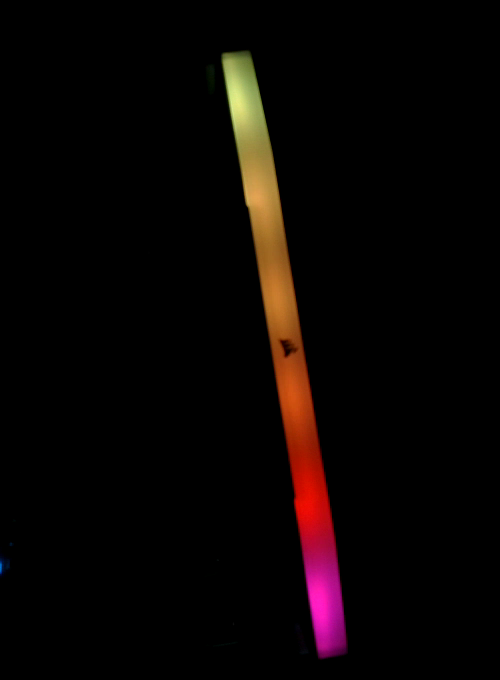

> **Draft, revision 0.1.** Every number in this document comes from one bench session on
> 6 October 2026, with one module. The supplied scripts were consolidated from the scripts
> used on the bench and have not themselves been run on hardware (Section 12). This revision
> is for internal review and is not for publication.

## 1 Introduction

A DDR5 DIMM exposes a two-wire sideband (HSCL, HSDA) separate from the memory bus. On it the
SPD5118 hub answers first; it holds the module's SPD data, reports temperature, and forwards
traffic to other devices on the module's local bus, such as the PMIC and, on lighting modules,
an RGB controller. The hub starts in I2C mode and can be switched to I3C.

This note covers reading the hub and those devices from a host adapter, without a motherboard.

### 1.1 Scope

This document covers:

- identifying the SPD5118 hub, reading its temperature sensor, and reading the 1 KB SPD NVM
- reading the PMIC status, read-only
- switching the hub to I3C with SETAASA, reading it in SDR, and returning it to I2C with RSTDAA
- the I3C rates that returned correct data on this bench, and the one that did not
- the Corsair RGB controller behind the hub: taking it out of firmware-update mode, setting
  colours per LED, and starting a hardware effect

It does not cover writing the SPD NVM, writing hub registers over I3C (Section 5.3 explains
why), in-band interrupts from the hub (attempted, none received), PEC, or access to the RGB
controller with the hub in I3C mode (not tried).

### 1.2 Applicable devices

Table: Applicable devices

| Role | Part | Identifier | Basis |
|---|---|---|---|
| Host adapter | Binho Supernova | hardware revision C, firmware 4.6.1 | measured, this document |
| SPD hub | SPD5118 on the module below | MR0-1 `51 18`, MR2 revision `0x14` | measured, this document |
| PMIC | PMIC on the module below | address `0x48` | read-only status, measured |
| RGB controller | Corsair Vengeance RGB RS DDR5, 6 LEDs | VID `0x1B1C`, PID `0x0B00` in firmware-update mode, `0x0B01` in normal mode | measured, this document |
| Module | Corsair `CMG16GX5M2E6000Z36` (one DIMM of the kit) | SPD byte 2 `0x12` (DDR5), byte 3 `0x02` (UDIMM) | measured, this document |
| Other SPD5118 modules | any DDR5 UDIMM or SODIMM | MR0-1 `51 18` | Sections 5.1 and 5.2 follow JESD300-5; not tested beyond one module |
| Other Corsair DDR5 RGB modules | | other PIDs | not tested |

### 1.3 Related documents

Table: Related documents

| Document | Title |
|---|---|
| JESD300-5 | SPD5118 Hub and Serial Presence Detect Device Standard (JEDEC) |
| JESD400-5 | DDR5 Serial Presence Detect (SPD) Contents (JEDEC) |
| MIPI I3C Basic | Improved Inter Integrated Circuit Basic specification |
| OpenRGB | Corsair DRAM controller source, the origin of the RGB register map in Section 5.4 |

## 2 System overview

Table: Devices seen on the sideband, hub in I2C mode, 100 kHz

| Address | Device | How it answers |
|---|---|---|
| `0x50` | SPD5118 hub | register pointer + read; also a bare read |
| `0x48` | PMIC | register pointer + read |
| `0x18` | Corsair RGB controller | **register pointer + read only**; a bare read is not acknowledged |

The module was strapped for HSA = 0, which puts the hub at `0x50`. The hub forwards
transactions for devices on the module's local bus to the host side; JESD300-5 calls the two
address fields the local ID and the host ID. In I2C mode this forwarding needed no
configuration. The PMIC and the RGB controller are reached through it.

Two facts shape everything below:

- **A bare read-scan does not find the RGB controller.** Scanning `0x08` to `0x77` with a
  one-byte read returned `0x48` and `0x50` only. Writing a register pointer and then reading
  finds it at `0x18`.
- **The hub is an I3C target that is not discovered by ENTDAA on this bench.** It takes its
  static address as its dynamic address on SETAASA, and returns to I2C on RSTDAA.

## 3 Hardware setup

### 3.1 Required equipment

Table: Required equipment

| Item | Note |
|---|---|
| Binho Supernova | firmware 4.6.1 used here |
| DDR5 module | the module in Section 1.2 for Part 3 |
| DIMM breakout | brings out HSCL, HSDA and GND, straps HSA, and supplies VIN_BULK from its own 5 V input |
| 5 V supply for the breakout | USB-C on the breakout used here |
| 4-wire cable | Supernova I3C LV connector to the breakout |

### 3.2 Connections

Table: Connections between the Supernova and the DIMM breakout

| Supernova I3C LV connector | DIMM breakout | Required |
|---|---|---|
| SCL | HSCL | yes |
| SDA | HSDA | yes |
| GND | GND | yes |

### 3.3 Bus considerations

The bus ran at **1.1 V** (set 1100 mV, read back 1106 mV). The Supernova picks the I3C
connector from the voltage alone:

Table: Supernova I3C connector selection

| Requested voltage | Connector |
|---|---|
| 800 to 1199 mV | LV |
| 1200 to 3300 mV | HV |

> **Caution:** a request of 1200 mV moves the bus to the HV connector. With the module on the
> LV connector, nothing answers. Request 1100 mV.

> **Caution:** the module needs 5 V on VIN_BULK. The breakout supplies it; the adapter does
> not. Power the module before bringing the bus up. To clear the hang in Section 5.3,
> power-cycle the module, not the adapter.

## 4 Software setup

```
pip install pycosmicsdk
python ddr5_spd.py --help
python ddr5_rgb.py --help
```

Both scripts use only public pycosmicsdk calls: `Device.open`, `I3cController.set_voltage`,
`bring_up`, `legacy_i2c_read`, `legacy_i2c_write`, `sdr_read`, `ccc.setaasa` and `ccc.rstdaa`.
Both take `--serial` to select an adapter and `--voltage-mv` (default 1100). The bench used a
Ubuntu 22.04 host with pycosmicsdk 1.6.0 and Python 3.10.

## 5 Registers and protocol

### 5.1 SPD5118 hub in I2C mode

All accesses are a one-byte register pointer followed by a read.

Table: Hub registers used

| Register | Read on this module | Meaning |
|---|---|---|
| MR0-1 | `51 18` | device type, SPD5118 |
| MR2 | `0x14` | device revision |
| MR5 | `0x03` | capabilities: hub and temperature sensor |
| MR11 | `0x00` | I2C legacy mode: bits 2:0 select the NVM page, bit 3 selects 2-byte addressing |
| MR12-13 | `FF 7F` | NVM write protection, one bit per 64-byte block |
| MR18 | `0x00` in I2C, `0x20` in I3C | bit 5 = I3C mode |
| MR49-50 | two bytes | temperature |

**Temperature.** MR50 bits 4:0 and MR49 bits 7:0 form a 13-bit field whose bits 1:0 are not
used. The remaining 11 bits are two's complement at 0.25 °C per LSB:

```python
raw = (((mr50 & 0x1F) << 8) | mr49) >> 2
if raw & 0x400:
    raw -= 0x800
celsius = raw * 0.25
```

The module read 27 to 29 °C on the bench. Its limit registers read 55 °C (high) and 85 °C
(critical).

**NVM.** The 1024-byte NVM is eight 128-byte pages. With 1-byte addressing, a pointer with
bit 7 set addresses the NVM, bits 6:0 the offset in the page, and MR11 bits 2:0 the page. To
read it all: save MR11, write pages 0 to 7 into it in turn, read 128 bytes from pointer `0x80`
on each, then write the saved value back. MR11 is the only register written. The dump from
this module decoded as byte 2 = `0x12` (DDR5) and byte 3 = `0x02` (UDIMM), and the CRC-16 (polynomial
`0x1021`, initial value 0) over bytes 0 to 509 matched the value stored in bytes 510 and 511.

**PMIC.** Register R32 read `0x80` (regulators enabled) and no fault bits were set. The PMIC
was only read.

### 5.2 SPD5118 hub in I3C mode

1. Bring the controller up as I3C.
2. Broadcast SETAASA with `0x50` in the device table. MR18 changes from `0x00` to `0x20`.
3. Read in SDR with a register pointer: `sdr_read(0x50, n, subaddress=bytes([reg]))`.
4. Broadcast RSTDAA. MR18 reads `0x00` again over I2C.

`init_bus()` discovers targets with ENTDAA and did not bring the hub up on this bench. Use
SETAASA.

Table: I3C SDR reads from the hub at 1.1 V, by push-pull rate

| Push-pull rate | Result |
|---|---|
| 1 MHz | 20/20 |
| 5 MHz | 50/50 (and 20/20 in a first run) |
| 6.25 MHz | 50/50 |
| 7.5 MHz | 50/50 |
| 10 MHz | 50/50 |
| 12.5 MHz | 9/50 correct; the other 41 returned wrong data under a success status |

A failure at 12.5 MHz was not reported as an error: the read completed and the data was wrong.
The breakout cabling at 1.1 V is the likely limit. **Use 4 MHz or less on long sideband
cabling.** 1 MHz (20/20) and 5 to 10 MHz were measured; rates between them were not. `ddr5_spd.py --i3c` defaults to 1 MHz.

### 5.3 Register writes over I3C

> **Caution:** register writes to the hub in I3C SDR mode did not land as written, and the bus
> then hung. A temperature limit written as 26.5 °C read back as 48 °C; `0x01` written to MR27
> read back as `0x10`. After that, every I3C operation returned `FW_I3C_ENGINE_BUSY`. A
> Supernova reboot did not clear it, nor did power-cycling the LV connector. Only a power cycle
> of the module did. The cause, the hub's I3C write format or the host side, was not
> established. In I3C mode, read only. If a write is needed, make it in I2C mode, or write a
> harmless register first and confirm it with a read-back.

### 5.4 Corsair RGB controller

The register map and packet formats below come from OpenRGB's Corsair DRAM controller
(GPL-2.0). The scripts in this document re-implement them from that description; no OpenRGB
code is copied. The controller is reached at `0x18` with the hub in I2C mode.

Every access is a write of `[register, value]`, or a register pointer followed by a one-byte
read. **The first access after the controller has been idle may be refused once; retry.**

Table: RGB controller registers used

| Register | Access | Use |
|---|---|---|
| `0x0B`, `0x21` | write `0x00` | reset the packet buffer and its CRC |
| `0x20` | write, one byte per access | packet buffer |
| `0x42` | read | CRC-8 of the bytes loaded since the reset |
| `0x82` | write | apply: `0x01` effect packet, `0x02` colour buffer |
| `0x30` | read | bit 3 set while busy applying |
| `0x61` then `0x21` | write `0x00` | select the device-info block |
| `0x40` | read, 32 times | device-info block |
| `0x23` | write `0x01` | leave firmware-update mode |

The CRC is CRC-8, polynomial `0x07`, initial value 0. Compare it with `0x42` before applying;
a mismatch means a byte was lost or repeated (a retried write can do that), and the packet
must not be applied.

**Device-info block.** Bytes 0-1 are the VID, little-endian; bytes 2-3 the PID; byte 28 the
protocol version.

**Firmware-update mode.** Both end LEDs lit red is Corsair's documented indication of
firmware-update (bootloader) mode. In that state the module reported PID `0x0B00` and
protocol 1, and accepted effect packets (CRC matched) without changing the LEDs. One write of
`0x01` to `0x23` changed it to PID `0x0B01`, protocol 4, and the factory rainbow came on
(Figure 1). How the module entered that mode was not established; it had been probed shortly
after power-up.

> **Caution:** never write `0x00` to register `0x23`.



**Colour buffer.** Six entries of `R, G, B, 0xFF`, one per LED, 24 bytes, loaded into `0x20`
after the reset, CRC checked, applied with `0x82` = `0x02`. This sets solid colour and per-LED
colour (Figure 2).


**Effect packet.** 20 bytes, applied with `0x82` = `0x01`:

```
mode, speed, 0x01, direction, R1, G1, B1, brightness, R2, G2, B2, brightness, 0 x 8
```

Table: Effect modes

| Mode | Code | Observed on this module |
|---|---|---|
| rainbow wave | `0x03` | yes |
| static | `0x10` | applied, but kept the previous colour; use the colour buffer instead |
| rainbow | `0x08` | not observed |
| pulse | `0x01` | not observed |

## 6 Procedure

1. Power the module from the breakout. Connect the cable to the Supernova I3C LV connector.
2. Identify the hub and read its temperature:

   ```
   python ddr5_spd.py --serial <serial>
   ```

   Expect `MR0-1 5118` and a temperature near room temperature.
3. Optionally save the NVM to a file of your choice. Treat the file as identifying the module:
   it contains the module's serial number.

   ```
   python ddr5_spd.py --serial <serial> --nvm my_module_spd.bin
   ```

   The script restores MR11 and reports whether the SPD CRC matches.
4. Optionally read the hub in I3C mode and return it to I2C:

   ```
   python ddr5_spd.py --serial <serial> --i3c --i3c-mhz 1
   ```

   Expect MR18 `0x20` during the I3C reads and `0x00` after RSTDAA.
5. Read the RGB controller's device info:

   ```
   python ddr5_rgb.py --serial <serial> info
   ```

6. If the PID is `0x0B00` (both ends red), leave firmware-update mode. The script writes only
   if the PID is `0x0B00`.

   ```
   python ddr5_rgb.py --serial <serial> leave-bootloader
   ```

7. Set colours or an effect:

   ```
   python ddr5_rgb.py --serial <serial> color 255,0,0
   python ddr5_rgb.py --serial <serial> color 255,0,0 255,80,0 255,220,0 0,255,0 0,0,255 160,0,255
   python ddr5_rgb.py --serial <serial> effect wave 255,0,0 0,0,255 --speed 2
   python ddr5_rgb.py --serial <serial> demo
   ```

The demo sequence is in `figures/an0016-video1-rgb-demo.mp4` (42 s), recorded from the bench
script it was consolidated from.

## 7 Reference

Table: ddr5_spd.py options

| Option | Effect |
|---|---|
| `--serial` | adapter serial number; default is the first adapter found |
| `--voltage-mv` | bus voltage, default 1100 (LV connector) |
| `--nvm FILE` | read the 1024-byte NVM into FILE via MR11, then restore MR11 |
| `--i3c` | SETAASA, SDR reads of MR18, MR0-1 and temperature, RSTDAA |
| `--i3c-mhz` | push-pull rate for `--i3c`: 1, 3.125 or 5; default 1 |

Table: ddr5_rgb.py commands

| Command | Effect |
|---|---|
| `info` | print VID, PID and protocol, after checking the block's CRC |
| `leave-bootloader` | write `0x23` = `0x01` if the PID is `0x0B00`; print the PID before and after |
| `color R,G,B` | all six LEDs one colour, through the colour buffer |
| `color` with six `R,G,B` | one colour per LED |
| `effect MODE C1 [C2]` | effect packet; MODE is static, rainbow, wave or pulse; `--speed` 0 to 2 |
| `demo` | red, green, blue, white, per-LED rainbow, chase, then rainbow wave |

Both scripts retry each access up to three (`ddr5_spd.py`) or five (`ddr5_rgb.py`) times.

## 8 Measured results

### 8.1 Test configuration

Table: Test configuration

| Item | Value |
|---|---|
| Adapter | Binho Supernova, hardware revision C, firmware 4.6.1 |
| Bus | I3C LV connector, 1100 mV requested, 1106 mV read back |
| I2C mode | 100 kHz open drain |
| I3C mode | SETAASA, SDR, push-pull rates in Section 5.2 |
| Module | Corsair `CMG16GX5M2E6000Z36`, one DIMM, on a DIMM breakout with its own 5 V supply |
| Host | Ubuntu 22.04, pycosmicsdk 1.6.0, Python 3.10 |
| Date | 6 October 2026 |

### 8.2 Results

Table: Results

| Measurement | Result |
|---|---|
| Hub identification, MR0-1 | `51 18` |
| Temperature, MR49-50 | 27 to 29 °C |
| NVM read via MR11 | 1024 bytes, SPD CRC over bytes 0-509 matches |
| SETAASA, MR18 | `0x00` to `0x20`; RSTDAA back to `0x00` |
| I3C SDR reads, 1 to 10 MHz | 20/20 at 1 MHz; 50/50 at each of 5, 6.25, 7.5 and 10 MHz |
| I3C SDR reads, 12.5 MHz | 9/50 correct, 41 wrong under a success status |
| I3C register writes | did not land as written; bus hung until the module was power-cycled |
| In-band interrupt from the hub | attempted, none received |
| RGB controller found at `0x18` | with register pointer + read only |
| Leave firmware-update mode | PID `0x0B00` to `0x0B01`, protocol 1 to 4, one run |
| Colour buffer, solid and per-LED | applied, CRC matched; see Figure 2 and the video |
| Effect packet, rainbow wave | applied |

These are results from one module on one bench, not specifications. Apart from the I3C read
counts, the number of repetitions was not recorded.

## 9 Troubleshooting

Table: Troubleshooting

| Symptom | Cause | Action |
|---|---|---|
| A scan finds `0x48` and `0x50` but nothing at `0x18` | the RGB controller does not acknowledge a bare read | write a register pointer and read, as `ddr5_rgb.py info` does |
| First access to `0x18` refused, the next one works | the controller was idle | retry; the scripts do |
| Both end LEDs red, effect packets accepted but nothing changes | the controller is in firmware-update mode, PID `0x0B00` | `ddr5_rgb.py leave-bootloader` |
| CRC mismatch at `0x42` | a byte was lost or repeated while loading | resend the whole packet; do not apply |
| `init_bus()` does not find the hub | the hub is not discovered by ENTDAA on this bench | use `ccc.setaasa([0x50])` |
| Nothing answers at all | 1200 mV or more selects the HV connector | request 1100 mV |
| Wrong data, success status, in I3C mode | push-pull rate too high for the cabling | 4 MHz or less |
| Every I3C operation returns `FW_I3C_ENGINE_BUSY` after an I3C write | the hub hung (Section 5.3) | power-cycle the module; a Supernova reboot does not clear it |
| NVM dump CRC mismatch | MR11 changed or a read failed mid-dump | re-run; check MR11 bit 3 is 0 |

## 10 Acronyms

Table: Acronyms

| Term | Meaning |
|---|---|
| CCC | Common Command Code (I3C) |
| CRC | Cyclic redundancy check |
| DIMM | Dual in-line memory module |
| ENTDAA | Enter Dynamic Address Assignment (I3C CCC) |
| HSA | Host sideband address strap |
| HSCL, HSDA | Host sideband clock and data |
| LED | Light-emitting diode |
| LV, HV | The Supernova's low-voltage and high-voltage I3C connectors |
| MR | Mode register of the SPD5118 |
| NVM | Non-volatile memory |
| PEC | Packet error check |
| PID, VID | Product ID, vendor ID |
| PMIC | Power management integrated circuit |
| RSTDAA | Reset Dynamic Address Assignment (I3C CCC) |
| SDR | Single data rate (I3C) |
| SETAASA | Set All Addresses to Static Address (I3C CCC) |
| SPD | Serial presence detect |
| UDIMM | Unbuffered DIMM |
| VIN_BULK | The DIMM's 5 V input supply |

## 11 Note about the source code in the document

Example code shown in this document and supplied in the accompanying archive is provided for
evaluation and reference. It is released under the MIT license, the text of which is included
in the archive.

Table: Contents of the assets archive

| File | Description |
|---|---|
| `AN0016.md` | Markdown source of this document |
| `assets/ddr5_spd.py` | Hub identification, temperature, NVM read, I3C read check |
| `assets/ddr5_rgb.py` | RGB controller: device info, leave firmware-update mode, colours, effects, demo |
| `assets/LICENSE` | MIT license covering the example code |
| `figures/an0016-video1-rgb-demo.mp4` | 42 s video of the demo sequence |

No SPD dump is supplied: a dump identifies one physical module.

## 12 Revision history

Table: Revision history

| Revision | Date | Description |
|---|---|---|
| 0.1 | 6 October 2026 | Initial draft. The bench runs used earlier, separate scripts; `ddr5_spd.py` and `ddr5_rgb.py` were consolidated from them, compile, and have not been run on hardware. |
